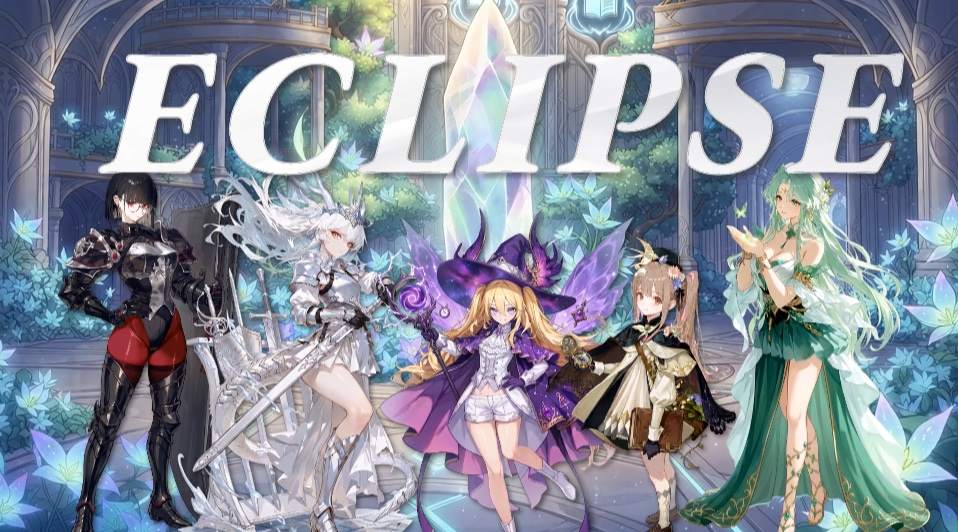
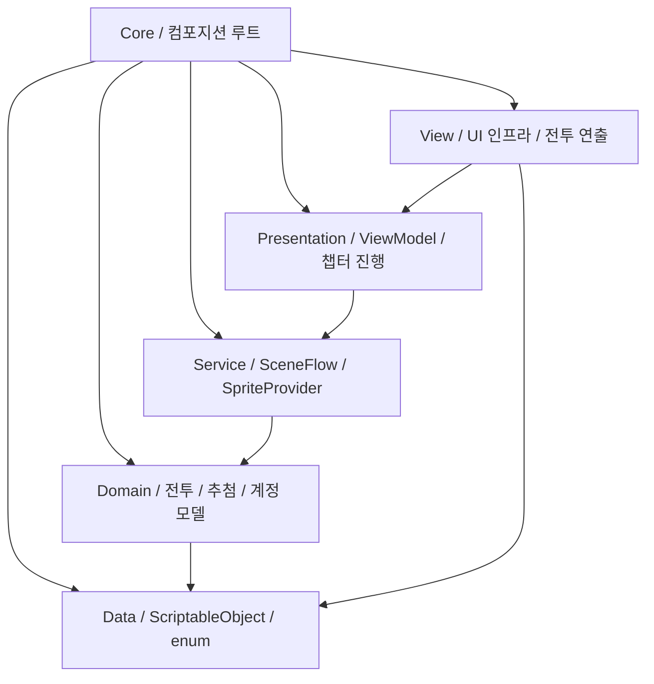

# ECLIPSE

수집형 턴제 RPG와 로그라이트를 결합한 2D 모바일 게임입니다.

🎮 [웹에서 플레이](https://gunheui.github.io/eclipse-webgl-build/) / 🎬 [플레이 영상](https://youtu.be/20YHP-EX6jo) / 📄 [기술 문서](./TECH.md)

위 이미지를 클릭하면 플레이 영상이 재생됩니다.

|                                                 |                                                    |
| ----------------------------------------------- | -------------------------------------------------- |
| **로비****          | **파티 편성****       |
| **전투****         | **약속의 문****       |
| **버프 카드****    | **성장****            |
| **캐릭터 목록**** | **캐릭터 상세**** |

---

## 웹에서 플레이

🎮 [**브라우저로 바로 플레이**](https://gunheui.github.io/eclipse-webgl-build/)

설치 없이 WebGL 빌드로 로비부터 챕터 1 보스까지 플레이할 수 있습니다. PC 브라우저(가로 화면) 기준이며, 세이브는 브라우저에 저장됩니다.

---

## 기술 스택

| 구분         | 사용 기술                                       |
| ---------- | ------------------------------------------- |
| 엔진 / 언어    | Unity 6000.5.2f1 (URP 2D) / C#              |
| DI         | VContainer 1.19.0                           |
| 리액티브 / 비동기 | R3 / UniTask (Cysharp)                      |
| 연출         | DOTween / URP 2D 아웃라인                       |
| 아키텍처       | 계층형 / MVVM (asmdef 실행 6 + Editor 1 + 테스트 2) |
| 테스트        | NUnit EditMode 테스트 속성 360개 / 47파일           |

---

## 아키텍처

| 레이어          | 역할                                                                                                  | 외부 의존                            |
| ------------ | --------------------------------------------------------------------------------------------------- | -------------------------------- |
| Data         | SO(Character/Enemy/Skill/Chapter/DoorCatalog/BuffCardCatalog/Mutation/BattleConstants), Stats, enum | 없음                               |
| Domain       | 순수 로직입니다. 전투(BattleEngine, ATB, 데미지 파이프라인, 타겟 정책)와 챕터 진행(인카운터 생성, 문/카드 추첨, 정산, 시드)                  | UniTask                          |
| Service      | 인프라 이음새(`ISceneFlow`, `ISpriteProvider`)                                                            | UniTask                          |
| Presentation | ViewModel, 챕터 진행 상태 머신, 성장, 재화, 세이브 서비스                                                              | R3                               |
| View         | View, ScreenManager/PopupManager, 테마, 전투 연출과 VFX                                                    | VContainer / R3 / UGUI / DOTween |
| Core         | 컴포지션 루트. 전 레이어를 조립하는 어셈블리입니다                                                                        | VContainer                       |

DI 스코프는 세 단계로 구성되어 있습니다. 앱 전역 `AppLifetimeScope` ,로비씬 `GameLifetimeScope`, 전투씬 `BattleLifetimeScope`으로 구성되어 있습니다.

---

## 대표 기술 과제

### 시드 기반 RNG 전투

같은 시드와 입력에서 동일한 전투 결과가 나오도록 고정소수점 연산과 xorshift128+ 난수 생성기를 적용했습니다. 이를 통해 플랫폼에 관계없이 전투를 재현할 수 있게 구성했습니다.

### 챕터 진행 상태 머신

전투, 문 선택, 카드, 보상 정산으로 이어지는 챕터 흐름을 순수 C# 상태 머신으로 관리합니다. 토큰을 활용하여 중복 입력과 늦게 도착한 콜백도 안전하게 무시되도록 처리합니다.

### 확률 시스템

캐릭터, 변이, 문, 카드가 각각 독립된 난수 스트림을 사용합니다. 한 시스템의 확률이나 로직을 수정해도 나머지 추첨 결과에는 영향을 주지 않도록 구성했습니다.

### 성장과 데이터

여러 재화를 사용하는 강화는 조건을 모두 확인한 뒤 한 번에 처리하고, 최종 스탯은 한곳에서 계산합니다. 게임 데이터는 `ScriptableObject`로 관리해 코드 수정 없이 밸런스를 조정할 수 있습니다.

### UI

ViewModel이 상태 변경을 스트림으로 전달하고, View는 이를 구독해 즉시 화면에 반영합니다. 덕분에 매 프레임 상태를 확인하는 폴링 없이 필요한 시점에만 UI가 갱신됩니다.

---

## 진행 현황

| 시스템                                         | 상태                    |
| ------------------------------------------- | --------------------- |
| 계층형 아키텍처 + DI 스코프 3계층                       | 구현 완료                 |
| 전투 코어 (ATB, 데미지, 타겟, 오토AI, 상태이상, 결정론)       | 구현 완료                 |
| 챕터 진행 (방 7, 문 지점 5, 보류 보상, 미드보스 문, 깊이 정산)   | 구현 완료                 |
| 확률 시스템 (인카운터, 변이, 문 추첨, 카드 선택)              | 구현 완료                 |
| 성장 (레벨업, 스킬 강화)                             | 구현 완료                 |
| 세이브 / 재화 3종 / 데이터 주도 SO                     | 구현 완료                 |
| UI (로비, 캐릭터, 성장, 편성, 전투 HUD, 문, 카드) / 전투 연출 | 구현 완료                 |
| 돌파                                          | 서비스만 구현. 재료 공급은 가챠 이후 |
| 가챠 (확률 테이블, 천장, 픽업 보장)                      | 구현 중                  |
| 챕터 2~5                                      | 구현 예정                 |
| 대사, 스토리, 상점                                 | 구현 예정                 |

---

## 사용 에셋 / 크레딧

| 카테고리  | 에셋 / 제작자                            | 라이선스                    |
| ----- | ----------------------------------- | ----------------------- |
| UI 키트 | Modular Game UI Kit                 | Asset Store EULA        |
| VFX   | Cartoon FX Remaster                 | Asset Store EULA        |
| VFX   | Magic effects pack                  | Asset Store EULA        |
| VFX   | Free Quick Effects Vol.1            | Asset Store EULA        |
| VFX   | Free Game VFX                       | Asset Store EULA        |
| VFX   | Hits Effects FREE                   | Asset Store EULA        |
| VFX   | Free Slash VFX                      | Asset Store EULA        |
| 폰트    | Pretendard / Anton                  | SIL OFL                 |
| 라이브러리 | VContainer / R3 / UniTask / DOTween | MIT 등 OSS / Asset Store |

