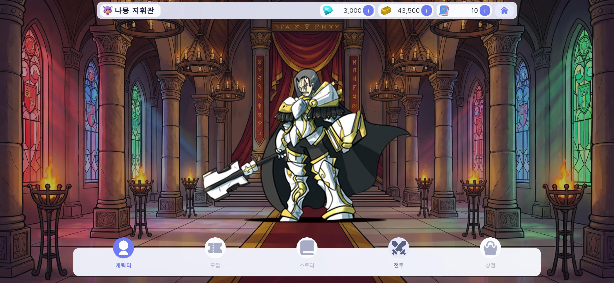
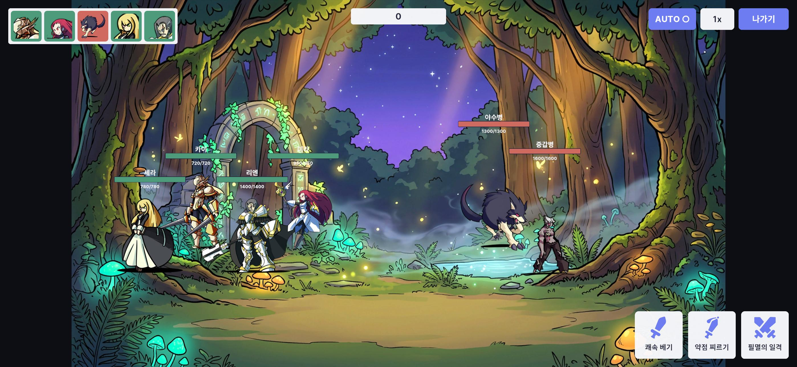
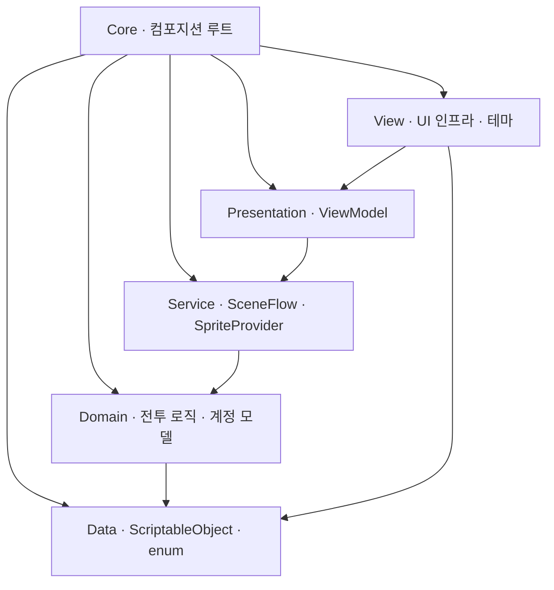

# ECLIPSE

> **2D 수집형 가챠 RPG** — 캐릭터를 뽑고, 편성하고, 턴제로 전투하는 모바일 게임.

🚧 **현재 개발 진행 중** — 아키텍처·턴제 전투 코어·데이터 주도 설계·UI(로비/캐릭터/전투)는 구현 완료, 성장·가챠 시스템을 이어서 개발 중입니다.

캐릭터를 수집·성장시켜 파티를 꾸리고 턴제 오토배틀로 전투하는 수집형 RPG입니다. 로비에서 캐릭터를 편성하고 전투에 진입하는 핵심 게임 루프를 중심으로, 결정론적 턴제 전투 코어와 계층형 아키텍처 위에 구현했습니다.

🎬 [플레이 영상](https://youtu.be/lnvDn0QfrFw)  ·  📄 [기술 문서](./TECH.md)

[](https://youtu.be/lnvDn0QfrFw)

▶️ **위의 이미지를 클릭하면 플레이 영상이 재생됩니다.**

**로비**


**캐릭터 선택**


**캐릭터 상세**


**전투**


---

## 개요 · 기술 스택

| 항목 | 내용 | | 구분 | 사용 기술 |
|---|---|---|---|---|
| 장르 | 수집형 가챠 RPG (턴제 오토배틀) | | 엔진 / 언어 | Unity 6000.5.2f1 (URP 2D) · C# |
| 플랫폼 | 모바일 가로 (2D) | | DI | VContainer 1.19.0 |
| 개발 기간 | 2026.07 ~ (진행 중, 개인) | | 리액티브 / 비동기 | R3 · UniTask (Cysharp) |
| 형상 관리 | Git | | 연출 | DOTween |
|  |  | | 아키텍처 | 계층형 · MVVM (asmdef 7개) |

---

## 아키텍처

의존성은 안쪽으로만 흐르도록 설계했습니다. 최하단 `Data`는 아무것도 참조하지 않는 순수 데이터 층이며, `Domain`은 엔진과 프레임워크에 종속되지 않는 로직 층으로 별도 환경에서도 단위 테스트가 가능합니다.



| 레이어 | 역할 | 외부 의존 |
|---|---|---|
| Data | SO(Character/Enemy/Skill/BattleConstants/GrowthCurve), Stats, enum | 없음 |
| Domain | 순수 전투 로직(BattleEngine·ATB·파이프라인·타겟정책·SeededRandom) + 계정 모델 | UniTask |
| Service | 인프라 이음새(`ISceneFlow`, `ISpriteProvider`) | UniTask |
| Presentation | ViewModel, CurrencyWallet, NavigationContext | R3 |
| View | View, ScreenManager/PopupManager, 테마, 전투 비주얼 | VContainer · R3 · UGUI · DOTween |
| Core | 컴포지션 루트 — 전 레이어를 조립하는 유일한 어셈블리 | VContainer |

컴포지션 루트는 씬 단위 부모-자식 3계층 스코프로 구성했습니다. `AppLifetimeScope`(루트, 씬 전환 시 유지) 아래에 `GameLifetimeScope`(로비)와 `BattleLifetimeScope`(전투, 전투 시드·데미지 파이프라인·ViewModel 팩토리 등록)를 둡니다.

---

## 핵심 시스템

### 결정론적 턴제 전투 (`Scripts/Domain/Battle`)

같은 시드와 같은 로스터라면 전투 결과가 항상 동일하게 재현됩니다. 이 결정론을 회귀 테스트의 기반으로 삼았습니다.

- ATB 스케줄러 — SPD 게이지를 고정소수점(`long`)으로 관리하고, 다음 행동자를 도달 시간의 정수 교차곱으로 비교합니다. 부동소수점을 배제해 플랫폼 간 동일한 결과를 보장하며, 행동 후에는 초과분을 다음 게이지로 이월합니다.
- 시드 기반 RNG — `System.Random` 대신 xorshift128+ 알고리즘을 직접 구현했고, 데미지 스트림과 타겟팅 스트림을 분리해 상호 간섭을 없앴습니다.
- 데미지 파이프라인 — `raw → 비율 방어경감 → 치명 → 분산`의 단일 경로로 처리하며, RNG 소비 순서를 고정합니다.
- 타겟 정책 / 오토 AI — 우선순위 사다리(도발 → 확정 처치 → 기본)를 아군 오토와 적 AI가 공유합니다. 적 AI는 의도적으로 약간 불완전하게 튜닝해 힐러 카운터플레이의 여지를 남겼습니다.

### 데이터 주도 설계 (`Scripts/Data`)

캐릭터·적·스킬·성장·이펙트를 모두 ScriptableObject로 정의했습니다. 밸런스 상수(`BattleConstantsSO`)와 성장 곡선(`GrowthCurve`)을 인스펙터에서 조정할 수 있어, 코드 수정이나 재컴파일 없이 기획 수치를 튜닝합니다.

### UI 아키텍처 (`Presentation` ↔ `View`)

ViewModel이 상태 스트림을 노출하고 View는 이를 구독하기만 하며, 로직을 갖지 않습니다. `BattleViewModel`은 턴당 한 번 발화하는 단일 신호에서 HP·쿨다운·행동 순서·승패를 파생하므로 폴링이 없습니다. 화면과 팝업은 스택 기반 `ScreenManager`(재진입 가드)와 모달 `PopupManager`로 일원화했습니다.

> 각 시스템의 상세 설계와 의사결정(ADR)은 [기술 문서](./TECH.md)를 참고하세요.

---

## 진행 현황 & 로드맵

| 시스템 | 상태 |
|---|---|
| 계층형 아키텍처 + 3계층 DI | ✅ 구현 |
| 전투 코어 (ATB·데미지·타겟·오토AI·상태이상·결정론) | ✅ 구현 |
| 데이터 주도 SO 설계 | ✅ 구현 |
| UI 아키텍처 (로비·캐릭터·전투 HUD) · UI 인프라 · 재화 HUD | ✅ 구현 |
| 성장 시스템 | 🟡 진행 중 — 성장 곡선·스탯 스케일 완료, 레벨업 루프(경험치/재화/돌파) 이어서 구현 예정 |
| 가챠 시스템 | ⬜ 예정 — 데이터 구조·UI 스텁 준비, 확률 테이블·천장(pity) 구현 예정 |
| 대사/스토리 씬 | ⬜ 예정 |

<details><summary>프로젝트 구조 · 씬</summary>

```
Assets/Eclipse/
├── Scripts/{Core, Data, Domain, Service, Presentation, View, Tests}
├── Scene/   # MainScene(로비) · BattleScene(전투) · EffectPreview(이펙트 저작) · BattleHudToneSample(톤 샘플)
└── Art/     # 개인 아트 리소스 (gitignore)
```
</details>

---

## 사용 에셋 · 크레딧

> 라이선스가 요구하는 출처 표기입니다. 재배포 금지 원본은 커밋하지 않고(`Art/`·`Plugins/`·`Packages/` gitignore) 크레딧만 남깁니다. NC(비상업)·AI 생성 아트는 배제했습니다.

| 카테고리 | 에셋 / 제작자 | 라이선스 |
|---|---|---|
| 캐릭터 아트 | **Aekashics Librarium** ([itch.io](https://aekashics.itch.io/)) | 상업 OK · **크레딧 필수 · 원본 재배포·NFT 금지** |
| UI 키트 | **Modular Game UI Kit** (ricimi, Unity Asset Store) | 유료 · Asset Store EULA |
| 배경 | **AssetSmithy — 50 Fantasy 2D Backgrounds** (무료 샘플러) | royalty-free 상업 |
| 이펙트 텍스처 | **Kenney — Particle Pack** | CC0 |
| 아이콘 | **game-icons.net** | CC BY 3.0 |
| 폰트 | **Pretendard** · **Anton** | SIL OFL / OFL |
| 라이브러리 | VContainer · R3 · UniTask · DOTween | MIT 등 OSS / Asset Store |
