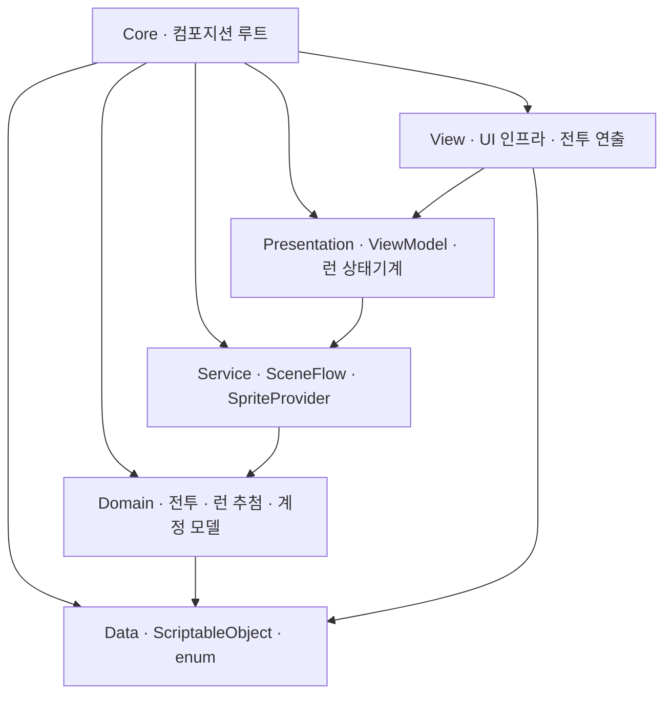

# ECLIPSE

> **수집형 턴제 RPG × 로그라이트 챕터 런** — 보상을 먼저 고르고, 다음 방을 살아 넘겨야 받는다.

🚧 **개발 진행 중** — 아키텍처·턴제 전투 코어·챕터 런 루프·확률 시스템·성장 3축·세이브까지 구현했고, 가챠와 챕터 2~5 확장이 남았습니다.

캐릭터를 영구히 키워 4인 파티를 짜는 바깥 층과, 그 파티로 들어가 방 7개를 돌파하는 로그라이트 런이 겹쳐 있는 구조입니다. 방과 방 사이에는 약속의 문 3개가 열립니다. 문 보상은 즉시 주지 않고 **다음 방을 살아서 넘겨야** 지급되며, 그 전에 전멸하면 몰수됩니다 — 문을 고르는 순간 판돈이 걸립니다.

🎬 [플레이 영상](https://youtu.be/lnvDn0QfrFw)  ·  📄 [기술 문서](./TECH.md)

[](https://youtu.be/lnvDn0QfrFw)

▶️ **위의 이미지를 클릭하면 플레이 영상이 재생됩니다.**

| | |
|---|---|
| **로비** — 루미아 성역<br> | **파티 편성** — 편성 화면이 곧 런 입구<br> |
| **전투** — ATB 턴제, 스킬 탭 후 대상 탭<br> | **약속의 문** — 3개 중 1개, 보상은 다음 방 뒤에<br> |
| **버프 카드 3택** — 등급별 가중 추첨, 강제 1택<br> | **성장** — 레벨업·스킬 강화·돌파(잠김)<br> |
| **캐릭터 목록** — 역할 필터·정렬<br> | **캐릭터 상세** — 스탯·스킬 3종<br> |

---

## 개요 · 기술 스택

| 항목 | 내용 | | 구분 | 사용 기술 |
|---|---|---|---|---|
| 장르 | 수집형 턴제 RPG × 로그라이트 | | 엔진 / 언어 | Unity 6000.5.2f1 (URP 2D) · C# |
| 플랫폼 | 모바일 가로 (2D) | | DI | VContainer 1.19.0 |
| 1회 플레이 | 수동 14~18분 · 오토 2배속 8~9분 | | 리액티브 / 비동기 | R3 · UniTask (Cysharp) |
| 개발 기간 | 2026.07 ~ (진행 중, 개인) | | 연출 | DOTween · URP 2D 아웃라인 |
| 형상 관리 | Git | | 아키텍처 | 계층형 · MVVM (런타임 asmdef 6개) |
|  |  | | 테스트 | NUnit EditMode 360케이스 |

---

## 게임 루프

바깥은 영구, 안쪽은 휘발입니다.

```
로비 ─[전투]→ 파티 편성(4/5인) ─[게임 시작]→ 챕터 런
      방1 → 문① → 방2 → 문② → 방3 → 문③ → 방4 → 문④ → 방5 → 문⑤ → 방6 → 방7 보스
      └ 문 지점 5곳 · 문③에는 미드보스 문이 반드시 섞인다
런 종료(클리어 또는 전멸) → 도달 깊이 정산 → 로비
```

| | 바깥 (영구) | 안쪽 (챕터 런) |
|---|---|---|
| 하는 일 | 레벨업 · 스킬 강화 · 4인 편성 | 방 7개 돌파 · 문 선택 · 버프 카드 수집 |
| 남는 것 | 캐릭터 성장, 재화 3종(골드 / 교본 / 보석) | 없음 — 버프는 런이 끝나면 사라진다 |

스테이지 선택 화면은 없습니다. 로비에서 [전투]를 누르면 파티 편성 화면이 그대로 런 입구가 되고, [게임 시작]으로 챕터 1이 시작됩니다. 방마다 나오는 적, 문 3개의 라인업, 문이 주는 카드 3장이 모두 추첨 결과라 같은 파티로 들어가도 두 번째 런은 다른 판이 됩니다.

---

## 아키텍처

의존성은 안쪽으로만 흐릅니다. 최하단 `Data`는 아무것도 참조하지 않는 순수 데이터 층이고, `Domain`은 엔진·프레임워크에 종속되지 않아 컨테이너 없이 `new`로 만들어 테스트합니다.



| 레이어 | 역할 | 외부 의존 |
|---|---|---|
| Data | SO(Character/Enemy/Skill/Chapter/DoorCatalog/BuffCardCatalog/Mutation/BattleConstants), Stats, enum | 없음 |
| Domain | 순수 로직 — 전투(BattleEngine·ATB·데미지 파이프라인·타겟 정책)와 런(인카운터 생성·문/카드 추첨·정산·시드) | UniTask |
| Service | 인프라 이음새(`ISceneFlow`, `ISpriteProvider`) | UniTask |
| Presentation | ViewModel, 챕터 런 상태기계, 성장·재화·세이브 서비스 | R3 |
| View | View, ScreenManager/PopupManager, 테마, 전투 연출·VFX | VContainer · R3 · UGUI · DOTween |
| Core | 컴포지션 루트 — 전 레이어를 조립하는 유일한 어셈블리 | VContainer |

컴포지션 루트는 씬 단위 부모-자식 3계층 스코프입니다. `AppLifetimeScope`(루트, 씬 전환 시 유지) 아래에 `GameLifetimeScope`(로비)와 `BattleLifetimeScope`(챕터 런)를 둡니다. 런 상태는 후자의 Scoped라 씬 언로드가 곧 런 폐기입니다 — "앱 종료 = 실패, 정산 0"이 별도 코드 없이 성립합니다.

---

## 핵심 시스템

### 결정론적 턴제 전투 (`Scripts/Domain/Battle`)

같은 시드와 같은 로스터면 전투가 항상 같게 재현됩니다. 이 결정론이 회귀 테스트의 기반입니다.

- **ATB 스케줄러** — SPD 게이지를 고정소수점(`long`)으로 관리하고, 다음 행동자를 도달 시간의 정수 교차곱으로 비교합니다. 부동소수점을 배제해 플랫폼 간 결과를 맞췄고, 행동 후 초과분은 다음 게이지로 이월합니다.
- **시드 기반 RNG** — `System.Random` 대신 xorshift128+를 직접 구현했습니다. 구간 정수 추첨은 Lemire 기법으로 모듈로 편향을 없앴습니다.
- **데미지 파이프라인** — `raw → 비율 방어경감 → 치명 → 분산`의 단일 경로로 계산하고 난수 소비 순서를 고정합니다. 실제 데미지와 최소 데미지 추정이 같은 본문을 공유하므로 막타 판정이 실데미지와 어긋나지 않습니다.
- **타겟 정책 / 오토 AI** — 우선순위 사다리(도발 → 확정 처치 → 기저)를 아군 오토와 적 AI가 공유하고, 차이는 프로파일 값으로만 냅니다. 적 AI는 막타 실행 확률을 0.6으로 낮춰 힐러 카운터플레이 여지를 남겼습니다.

### 챕터 런 상태기계 (`Scripts/Presentation/Run`)

방 7개와 문 지점 5곳의 진행 전체를 순수 C# 상태기계가 소유합니다. 화면은 제시물을 구독하고 선택만 보고합니다.

- **전이 토큰 멱등** — 더블 탭이나 늦은 애니메이션 콜백이 실제로 도착하는 구간이라, 스텝 종류가 아니라 전이 횟수로 보고를 검증합니다.
- **에스크로** — 문 보상은 종류와 깊이만 보류했다가 다음 방 클리어 시 해소합니다. 전멸하면 몰수됩니다.
- **종료 커밋 순서 고정** — 몰수 → 정산 → 클리어 기록 → 지급 → 저장 → 팝업. 지급과 저장을 UI 대기 앞에 끝내 정산 화면에서 앱이 죽어도 확정 재화가 남습니다.
- **선택은 값이 아니라 자리 번호로 받습니다** — 화면이 만들어 낸 값을 상태기계가 신뢰하지 않도록, 보상은 제시물에서 직접 꺼냅니다.

### 확률 시스템 (`Scripts/Domain/Run`)

런 시드 하나에서 인카운터·변이·문·카드 4개 스트림을 파생시켜, 한쪽 튜닝이 다른 쪽 수열을 밀지 않게 격리했습니다.

| 표면 | 방식 |
|---|---|
| 인카운터 생성 | 깊이별 마리수 롤 → 슬롯별 풀 롤 → 마리당 변이 독립 롤, 정예는 같은 경로 위 오버레이 |
| 약속의 문 | 문 8종(파티원 4인 캐릭터 문 + 저주 + 골드 + 교본 + 보석) 비복원 가중 추첨, 지점당 한 번에 추첨 후 자리 배분 |
| 버프 카드 3택 | 등급 가중(커먼/레어/에픽/유니크) 비복원 추첨, 보유한 유니크는 후보에서 제외하고 재정규화 |
| 재화 문 금액 | 선택 시점에는 굴리지 않고 공개 시점에 롤, 반올림은 마지막 1회 |

카탈로그 35행에 가중치를 일일이 적는 대신 등급 노브 4개에서 파생시킵니다. 카드 추가는 코드 수정 없이 행 추가로 끝납니다.

### 성장 3축 (`Scripts/Presentation/Growth`)

레벨업(골드), 스킬 강화(골드+교본), 돌파(가챠 중복 — 공급 전까지 잠금). 2재화 결제는 둘 다 확인한 뒤 둘 다 차감해 반쪽 결제를 막았고, 최종 스탯은 레벨·돌파·버프 곱을 한 함수에서만 접습니다. 성장이 확정되면 신호 하나가 발화하고, 그 캐릭터를 표시 중인 화면들이 각자 다시 읽습니다 — Refresh 호출자가 없습니다.

### 데이터 주도 설계 (`Scripts/Data`)

캐릭터·적·스킬·챕터·문·카드·변이·이펙트·밸런스 상수를 전부 ScriptableObject로 정의했습니다. 방어 계수·분산·적 막타 확률 같은 밸런스 노브를 인스펙터에서 돌려 재컴파일 없이 튜닝합니다.

### UI 아키텍처 (`Presentation` ↔ `View`)

ViewModel이 R3 스트림으로 상태를 내보내고 View는 구독만 합니다. `BattleViewModel`은 턴당 한 번 발화하는 단일 신호에서 HP·쿨다운·행동 순서·승패를 파생하므로 폴링이 없습니다. 화면과 팝업은 스택 기반 `ScreenManager`(비동기 재진입 가드)와 모달 `PopupManager`로 일원화했습니다.

### 테스트

EditMode 360케이스. 도메인은 컨테이너 없이 돌고, 런 상태기계는 화면 없이 방 7개 풀 사이클을 회귀합니다. 카탈로그 드리프트 테스트가 SO 데이터와 코드 기대치의 어긋남을 로드 시점에 잡습니다.

> 설계 의도와 결정 근거는 [기술 문서](./TECH.md)에 정리했습니다.

---

## 진행 현황 & 로드맵

| 시스템 | 상태 |
|---|---|
| 계층형 아키텍처 + 3계층 DI | ✅ 구현 |
| 전투 코어 (ATB·데미지·타겟·오토AI·상태이상·결정론) | ✅ 구현 |
| 챕터 런 루프 (방 7 · 문 5 · 에스크로 · 미드보스 문 · 도달 깊이 정산) | ✅ 구현 |
| 확률 시스템 (인카운터·변이·문 추첨·카드 3택) | ✅ 구현 |
| 성장 3축 (레벨업 · 스킬 강화 / 돌파는 가챠 대기) | ✅ 구현 |
| 세이브 · 재화 3종 · 데이터 주도 SO | ✅ 구현 |
| UI (로비·캐릭터·성장·편성·전투 HUD·문·카드) · 전투 연출 | ✅ 구현 |
| 가챠 (확률 테이블 · 천장 · 픽업 보장) | ⬜ 설계 완료, 구현 예정 |
| 챕터 2~5 연속 런 | ⬜ 예정 — 챕터 1 데이터에 난이도 계수만 얹는 구조 |
| 대사/스토리 · 상점 | ⬜ 범위 밖 |

<details><summary>프로젝트 구조 · 씬</summary>

```
Assets/Eclipse/
├── Scripts/{Core, Data, Domain, Service, Presentation, View, Editor, Tests}
├── Scene/   # MainScene(로비·아웃게임) · BattleScene(챕터 런 전체) · EffectPreview(이펙트 저작) · BattleHudToneSample(톤 샘플)
└── Art/     # 개인 아트 리소스 (gitignore)
```

씬은 둘입니다. `MainScene`이 로비와 아웃게임 화면 전부, `BattleScene`이 챕터 런 전체(전투·문·카드 선택)를 맡습니다.
</details>

---

## 사용 에셋 · 크레딧

> 라이선스가 요구하는 출처 표기입니다. 재배포 금지 원본은 커밋하지 않고(`Art/`·`Plugins/`·`Packages/` gitignore) 크레딧만 남깁니다. NC(비상업)·AI 생성 아트는 배제했습니다.

| 카테고리 | 에셋 / 제작자 | 라이선스 |
|---|---|---|
| 캐릭터 아트 | **Aekashics Librarium** ([itch.io](https://aekashics.itch.io/)) | 상업 OK · **크레딧 필수 · 원본 재배포·NFT 금지** |
| UI 키트 | **Modular Game UI Kit** (ricimi, Unity Asset Store) | 유료 · Asset Store EULA |
| 배경 | **AssetSmithy — 50 Fantasy 2D Backgrounds** (무료 샘플러) | royalty-free 상업 |
| 이펙트 | **Cartoon FX Remaster** (JMO Assets) · **Magic Effects Pack** (Hovl Studio) · **Free Quick Effects Vol.1** (Gabriel Aguiar) · **Free Game VFX** (Eric) · **Hits Effects FREE** (Matthew Guz) · **Free Slash VFX** | Asset Store EULA |
| 파티클 텍스처 | **Kenney — Particle Pack** | CC0 |
| 아이콘 | **game-icons.net** | CC BY 3.0 |
| 폰트 | **Pretendard** · **Anton** | SIL OFL / OFL |
| 라이브러리 | VContainer · R3 · UniTask · DOTween | MIT 등 OSS / Asset Store |
