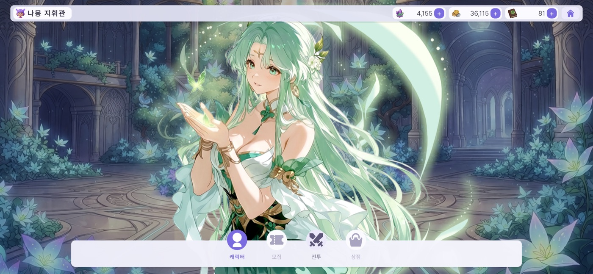
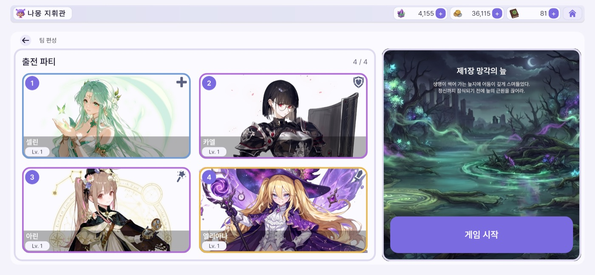
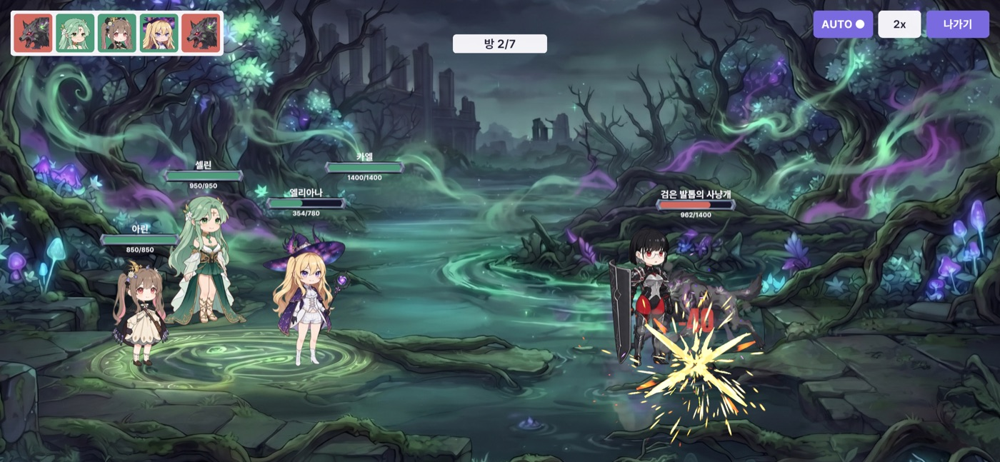
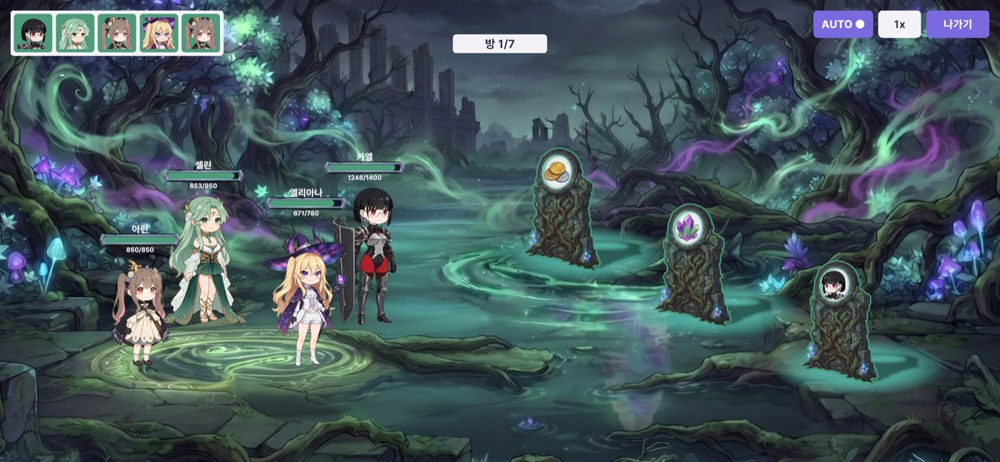
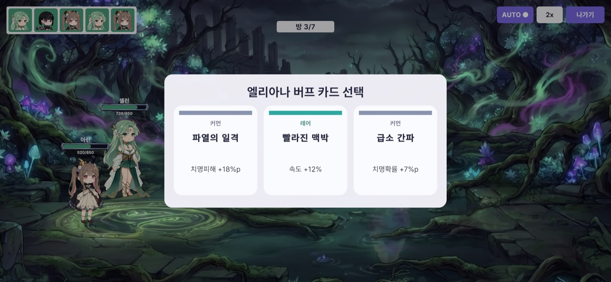
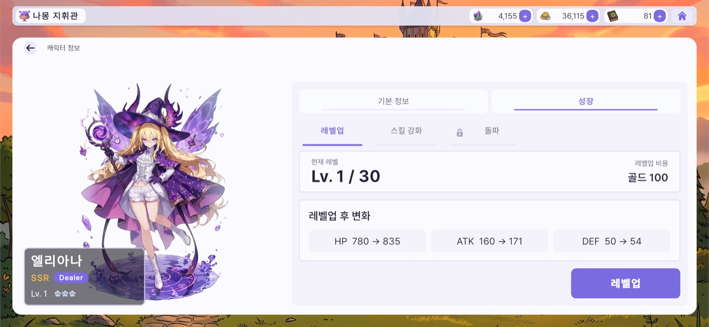
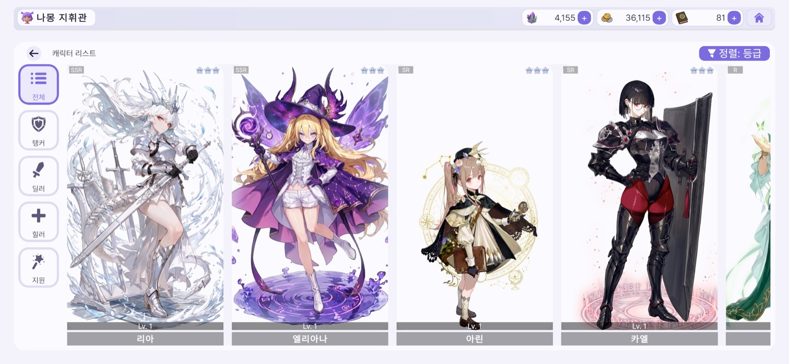
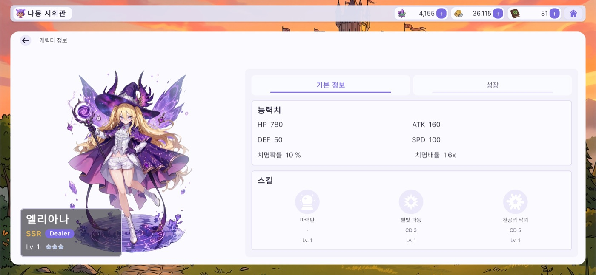

# ECLIPSE

수집형 턴제 RPG와 로그라이트를 결합한 2D 모바일 게임입니다. 로비에서 캐릭터를 영구 성장시켜 5명 중 4명을 편성하고, 그 파티로 챕터에 들어가 방 7개를 돌파합니다. 방과 방 사이에서 고른 보상은 즉시 받지 못합니다. 다음 방을 통과해야 지급되고, 그 방에서 전멸하면 사라집니다.

개발 진행 중입니다. 챕터 1의 전투·문 선택·성장·세이브까지 구현했고, 가챠와 챕터 2~5는 아직 만들지 않았습니다.

🎬 [플레이 영상](https://youtu.be/lnvDn0QfrFw) · 📄 [기술 문서](./TECH.md)

[](https://youtu.be/lnvDn0QfrFw)

위 이미지를 클릭하면 플레이 영상이 재생됩니다.

| | |
|---|---|
| **로비**<br>거점 루미아 성역. 전투·캐릭터·성장으로 갈라집니다<br> | **파티 편성**<br>5명 중 4명을 고르면 곧바로 챕터가 시작됩니다<br> |
| **전투**<br>ATB 턴제입니다. 스킬을 탭하고 대상을 탭해 행동을 확정합니다<br> | **약속의 문**<br>세 개 중 하나를 고릅니다. 무엇을 주는지는 문에 적혀 있습니다<br> |
| **버프 카드**<br>세 장 중 한 장을 반드시 고릅니다. 등급마다 추첨 가중이 다릅니다<br> | **성장**<br>레벨업과 스킬 강화. 돌파 탭은 가챠 구현 전까지 잠겨 있습니다<br> |
| **캐릭터 목록**<br>역할 필터와 정렬<br> | **캐릭터 상세**<br>6스탯과 스킬 3종<br> |

---

## 게임 규칙

플레이 단위는 챕터 하나입니다. 스테이지 선택 화면은 없고, 로비에서 [전투]를 누르면 편성 화면이 그대로 입구가 됩니다.

챕터 1은 방 7개로 이루어집니다. 방 1~5를 클리어하면 문 세 개가 서고 그중 하나를 고릅니다. 세 번째 지점에는 미드보스 문이 반드시 섞이는데, 이 문을 고르면 다음 방이 정예 전투가 되는 대신 보상 두 종이 걸리고 피하면 일반 전투를 치릅니다. 방 6을 이기면 보스 방으로 이어지는 문 하나만 서고, 방 7의 보스를 잡으면 클리어입니다.

문 보상은 선택 즉시 주지 않고 보류합니다. 다음 방에서 살아남아야 지급되고, 그 방에서 전멸하면 몰수됩니다. 클리어든 전멸이든 도달 깊이에 따라 정산을 받지만, 포기하거나 앱을 종료하면 적립분까지 전부 사라집니다.

| | 로비 | 챕터 |
|---|---|---|
| 하는 일 | 레벨업, 스킬 강화, 4인 편성 | 방 7개 돌파, 문 선택, 버프 카드 수집 |
| 남는 것 | 캐릭터 성장, 재화 3종(골드·교본·보석) | 확정된 재화만 계정에 남고 버프는 사라집니다 |

방의 적 구성, 문 세 개의 라인업, 문이 내미는 카드가 모두 추첨 결과입니다. 같은 파티로 다시 도전해도 판이 달라집니다.

---

## 기술 스택

| 항목 | 내용 | | 구분 | 사용 기술 |
|---|---|---|---|---|
| 장르 | 수집형 턴제 RPG × 로그라이트 | | 엔진 / 언어 | Unity 6000.5.2f1 (URP 2D) · C# |
| 플랫폼 | 모바일 가로 (2D) | | DI | VContainer 1.19.0 |
| 1회 플레이 | 설계 기준 수동 14~18분 | | 리액티브 / 비동기 | R3 · UniTask (Cysharp) |
| 개발 기간 | 2026.07 ~ (진행 중, 개인) | | 연출 | DOTween · URP 2D 아웃라인 |
| 형상 관리 | Git | | 아키텍처 | 계층형 · MVVM (asmdef 실행 6 + Editor 1 + 테스트 2) |
| | | | 테스트 | NUnit EditMode 테스트 속성 360개 / 47파일 |

---

## 아키텍처

의존 방향을 안쪽으로 고정했습니다. 최하단 `Data`는 아무것도 참조하지 않고, `Domain`은 엔진과 프레임워크에 의존하지 않아 컨테이너 없이 `new`로 만들어 테스트합니다.


| 레이어 | 역할 | 외부 의존 |
|---|---|---|
| Data | SO(Character/Enemy/Skill/Chapter/DoorCatalog/BuffCardCatalog/Mutation/BattleConstants), Stats, enum | 없음 |
| Domain | 순수 로직입니다. 전투(BattleEngine·ATB·데미지 파이프라인·타겟 정책)와 챕터 진행(인카운터 생성·문/카드 추첨·정산·시드) | UniTask |
| Service | 인프라 이음새(`ISceneFlow`, `ISpriteProvider`) | UniTask |
| Presentation | ViewModel, 챕터 진행 상태기계, 성장·재화·세이브 서비스 | R3 |
| View | View, ScreenManager/PopupManager, 테마, 전투 연출과 VFX | VContainer · R3 · UGUI · DOTween |
| Core | 컴포지션 루트. 전 레이어를 조립하는 유일한 어셈블리입니다 | VContainer |

DI 스코프는 세 단계입니다. 앱 전역의 `AppLifetimeScope` 아래에 로비용 `GameLifetimeScope`, 그 아래에 챕터용 `BattleLifetimeScope`를 둡니다. 챕터 진행 상태를 마지막 스코프에 두었기 때문에 씬을 내리면 상태도 함께 사라집니다. 앱을 종료했다가 다시 켜도 중단된 도전을 복구하지 않는 것이 이 구조에서 나옵니다.

---

## 대표 기술 과제

선택 이유와 실패 사례는 [기술 문서](./TECH.md)에 정리했습니다.

### 결정론적 전투

같은 코드·데이터 버전에서 같은 시드·로스터·입력을 주면 전투가 재현됩니다. SPD 게이지를 고정소수점 `long`으로 다루고 다음 행동자를 정수 교차곱으로 비교해 부동소수점을 배제했고, 난수는 `System.Random` 대신 xorshift128+를 구현했습니다. 이 성질이 전투와 확률 시스템 회귀 테스트의 토대입니다.

### 챕터 진행 상태기계

방 7개와 문 지점의 진행을 순수 C# 클래스가 소유하고 화면은 제시물을 구독해 선택만 보고합니다. 더블 탭이나 늦은 콜백이 실제로 도착하는 구간이라, 보고마다 전이 토큰을 검사하고 화면은 보상 값 대신 고른 자리 번호만 넘깁니다.

### 확률 시스템

챕터 시드 하나에서 인카운터·변이·문·카드 네 스트림을 파생시켜, 한쪽을 튜닝해도 다른 쪽 수열이 밀리지 않게 격리했습니다. 문과 카드는 비복원 가중 추첨이고, 카드 가중치는 카탈로그 행이 아니라 등급 값 네 개에서 계산합니다.

### 성장과 데이터

골드를 쓰는 레벨업과 골드·교본을 함께 쓰는 스킬 강화를 지원합니다. 두 재화 결제는 둘 다 확인한 뒤 함께 차감하고, 최종 스탯은 레벨·돌파·버프 곱을 한 함수에서만 접습니다. 캐릭터·적·스킬·챕터·문·카드·변이와 밸런스 상수는 ScriptableObject로 정의해 재컴파일 없이 튜닝합니다.

### UI와 테스트

ViewModel이 R3 스트림으로 상태를 내보내고 View는 구독만 합니다. `BattleViewModel`은 턴마다 한 번 발화하는 신호에서 HP·쿨다운·행동 순서·승패를 파생하므로 폴링이 없습니다. 테스트는 도메인 로직, 상태기계 전체 흐름, SO 데이터 드리프트 세 방향을 덮습니다.

---

## 진행 현황

| 시스템 | 상태 |
|---|---|
| 계층형 아키텍처 + DI 스코프 3계층 | 구현 완료 |
| 전투 코어 (ATB·데미지·타겟·오토AI·상태이상·결정론) | 구현 완료 |
| 챕터 진행 (방 7 · 문 지점 5 · 보류 보상 · 미드보스 문 · 깊이 정산) | 구현 완료 |
| 확률 시스템 (인카운터·변이·문 추첨·카드 3택) | 구현 완료 |
| 성장 (레벨업 · 스킬 강화) | 구현 완료 |
| 세이브 · 재화 3종 · 데이터 주도 SO | 구현 완료 |
| UI (로비·캐릭터·성장·편성·전투 HUD·문·카드) · 전투 연출 | 구현 완료 |
| 돌파 | 서비스만 구현. 재료 공급은 가챠 이후 |
| 가챠 (확률 테이블 · 천장 · 픽업 보장) | 미구현. 설계만 완료 |
| 챕터 2~5 | 미구현 |
| 대사·스토리, 상점 | 범위 밖 |

<details><summary>프로젝트 구조 · 씬</summary>

```
Assets/Eclipse/
├── Scripts/{Core, Data, Domain, Service, Presentation, View, Editor, Tests}
├── Scene/   # MainScene · BattleScene · EffectPreview · BattleHudToneSample
└── Art/     # 개인 아트 리소스 (gitignore)
```

플레이 씬은 둘입니다. `MainScene`이 로비와 아웃게임 화면을, `BattleScene`이 전투·문·카드 선택을 포함한 챕터 플레이 전체를 맡습니다. `EffectPreview`는 이펙트 저작용, `BattleHudToneSample`은 HUD 톤 확인용 보조 씬입니다.
</details>

---

## 사용 에셋 · 크레딧

아래는 빌드에 포함된 외부 에셋과 라이선스입니다. 재배포가 금지된 아트와 플러그인 원본은 Git 추적에서 제외했고, 패키지 의존성 정보만 남겼습니다. 캐릭터와 적 배틀러, 배경은 직접 제작했습니다.

| 카테고리 | 에셋 / 제작자 | 라이선스 |
|---|---|---|
| UI 키트 | Modular Game UI Kit — ricimi | Asset Store EULA |
| VFX | Cartoon FX Remaster — JMO Assets | Asset Store EULA |
| VFX | Magic effects pack — Hovl Studio | Asset Store EULA |
| VFX | Free Quick Effects Vol.1 — Gabriel Aguiar Productions | Asset Store EULA |
| VFX | Free Game VFX — Eric VFX Studio | Asset Store EULA |
| VFX | Hits Effects FREE — Matthew Guz | Asset Store EULA |
| VFX | Free Slash VFX | Asset Store EULA |
| 폰트 | Pretendard · Anton | SIL OFL |
| 라이브러리 | VContainer · R3 · UniTask · DOTween | MIT 등 OSS · Asset Store |
