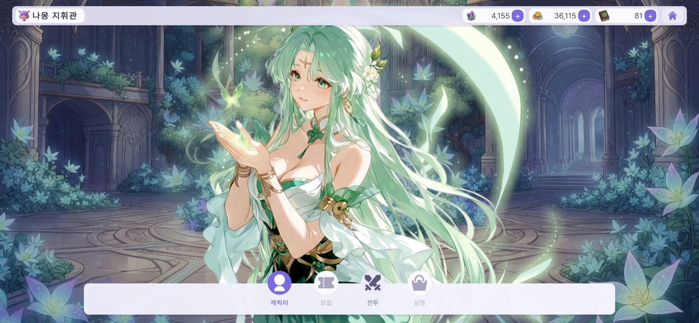
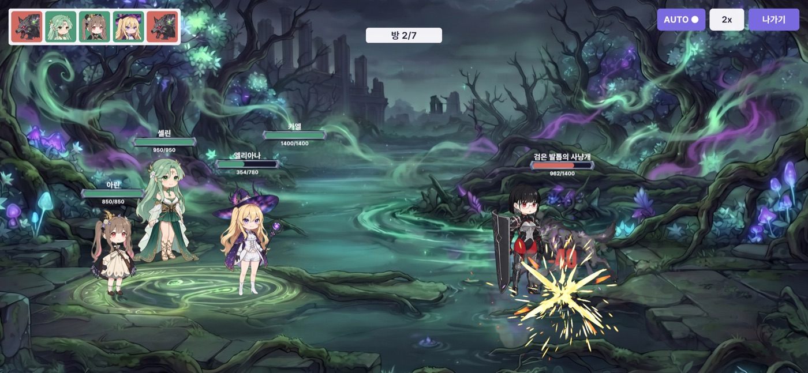
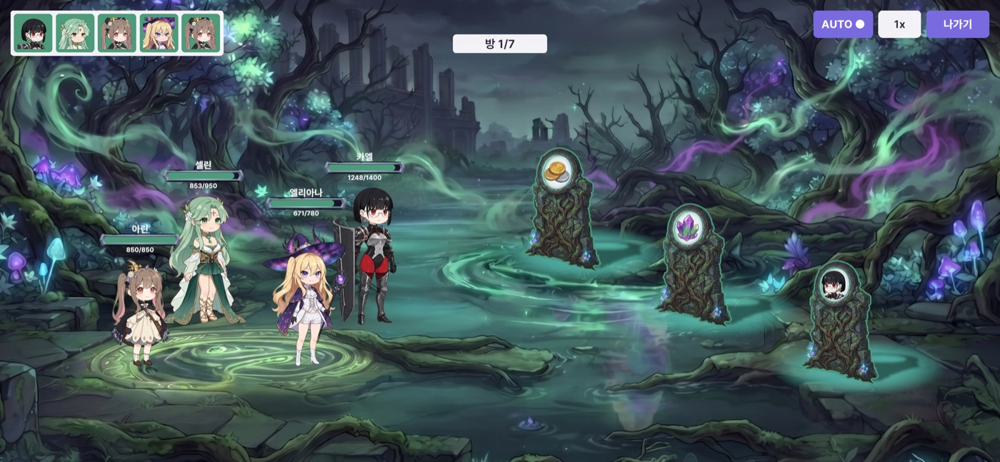
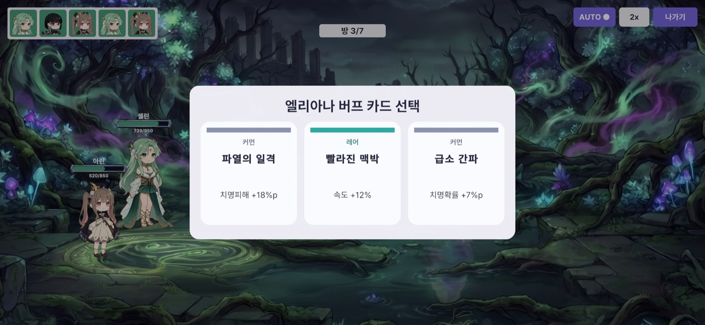
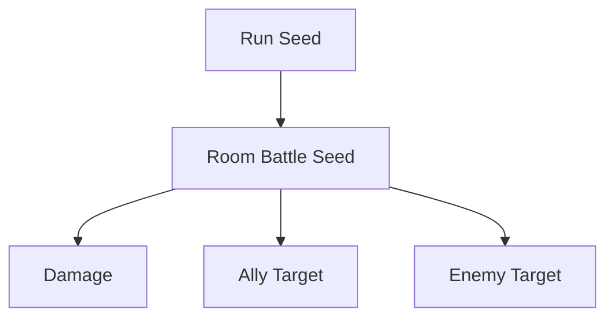
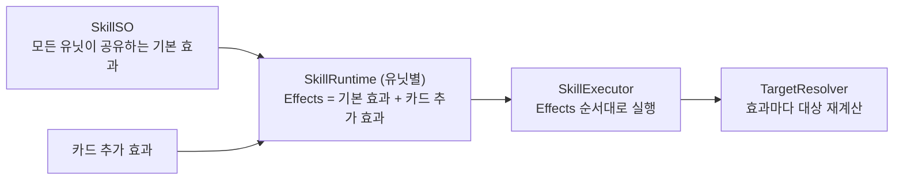
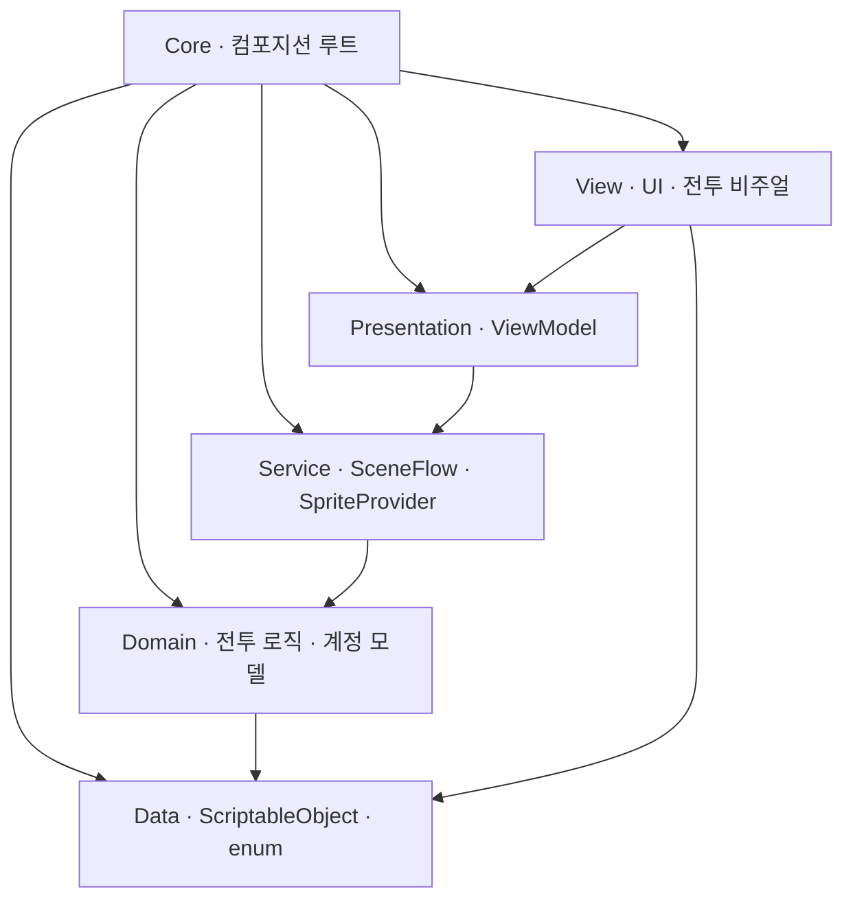

# ECLIPSE

> **로그라이트 턴제 RPG** — 속도 게이지(ATB)로 행동 순서가 정해지는 파티 전투에서, 전투마다 카드를 골라 스킬을 강화하며 런을 진행합니다.

<!-- TODO: iOS / Android 링크를 실제 주소로 교체 -->
🎬 [플레이 영상](https://youtu.be/20YHP-EX6jo) · 🌐 [브라우저 플레이](https://gunheui.github.io/eclipse-webgl-build/) · 📱 [iOS 빌드](#) · 🤖 [Android 빌드](#)

[](https://youtu.be/20YHP-EX6jo)

▶️ 이미지를 클릭하면 플레이 영상이 재생됩니다.

---

## 한눈에 보기

| 항목 | 내용 | | 구분 | 사용 기술 |
|---|---|---|---|---|
| 장르 | 로그라이트 턴제 RPG (ATB 파티 전투) | | 엔진 / 언어 | Unity 6 (URP 2D) · C# |
| 플랫폼 | WebGL · iOS · Android | | DI | VContainer |
| 개발 기간 | 2026.06 ~ 진행 중 (개인 프로젝트) | | 리액티브 / 비동기 | R3 · UniTask |
| 담당 | 클라이언트 전체 설계·구현 | | 연출 | DOTween |
| | | | 아키텍처 | 계층형 · MVVM (asmdef 7개) |

### 게임 구조

| 속도로 정해지는 턴 | 전투마다 고르는 보상 | 수동과 오토 전투 |
|---|---|---|
| 게이지가 먼저 차는 유닛부터 행동하는 ATB 파티 전투 | 전투 후 카드를 골라 스킬에 새 효과를 추가 | 직접 고르든 오토로 돌리든 같은 규칙으로 진행 |

| 로비 | 전투 |
|---|---|
|  |  |
| **약속의 문** | **버프 카드** |
|  |  |

---

## 핵심 구현

### 1. 같은 시드면 같은 전투가 재현되는 결정론적 전투

**문제** — 타겟 선택과 데미지 변동이 실행마다 달라지면 버그 상황을 다시 만들 수 없고, 로직 수정 전후 결과도 비교할 수 없습니다.

**난수 생성기 선택**

| 후보 | 판단 |
|---|---|
| `System.Random` | ✕ 런타임·버전 간 같은 수열이 API로 보장되지 않음 |
| xorshift128+ 직접 구현 | ✓ 알고리즘이 코드에 있어 Mono·IL2CPP 모두 같은 수열 |

**시드 구조** — 런 시드 하나에서 모든 난수를 파생합니다.


```mermaid
flowchart TD
    Run["Run Seed"] --> Room["Room Battle Seed"]
    Room --> Dmg["Damage"]
    Room --> Ally["Ally Target"]
    Room --> Enemy["Enemy Target"]
```

**문제가 생길 때마다 스트림을 나눈 과정**

| 단계 | 발견한 문제 | 해결 |
|---|---|---|
| 용도별 분리 | 타겟 로직을 바꾸면 데미지 난수까지 달라짐 | 데미지 / 타겟 스트림 분리 |
| 진영별 분리 | 아군의 난수 소비량이 적의 타겟 선택에 영향 | 아군 / 적 타겟 스트림 분리 |
| 파생 방식 교체 | 방 번호와 스트림 번호를 XOR로 섞자 서로 다른 시드가 겹침 | 부모 시드와 스트림 번호를 이어 붙인 뒤 SplitMix64로 섞음 |

```csharp
// AS-IS: (r^101)^0 == (r^100)^1  → 1번 방 데미지 시드 = 0번 방 아군 타겟 시드
// TO-BE: 부모 시드와 스트림 번호를 이어 붙인 뒤 섞기
ulong child = SplitMix64((seed << 32) | stream);
```

**테스트로 확인한 것**
- 연출 속도와 무관하게 매 턴 HP가 동일
- 아군의 난수 소비량과 무관하게 적의 타겟 선택이 동일
- 방·용도별로 만든 시드 53종이 서로 겹치지 않음

📂 `SeededRandom.cs` · `RunSeed.cs` · `BattleSeed.cs`

---

### 2. 실제 턴 계산을 그대로 재사용하는 ATB 순서 미리보기

**문제** — 전투 화면은 다음 행동 순서를 미리 보여줍니다. 미리보기를 별도 로직으로 계산하면 규칙을 바꿀 때마다 수정 지점이 두 곳이 되고, 두 로직이 조금씩 어긋나게 됩니다.

**설계** — 턴 계산을 `static` 함수 하나로 만들고, 미리보기는 게이지 **사본**을 같은 함수에 넘깁니다. `static`이라 원본 게이지에 직접 접근할 수 없습니다.

```csharp
// 실제 진행: 원본 게이지를 갱신
var actor = Advance(_gauge, alive, opening);

// 미리보기: 사본 위에서 같은 함수 실행, 원본은 그대로
var copy = new Dictionary<ICombatant, long>(_gauge);
var next = Advance(copy, alive, opening);
```

**규칙**
- 다음 행동자 = `남은 거리 ÷ 속도`가 가장 작은 유닛
- 동률일 때: 속도 → 아군 → 슬롯 순
- 게이지는 고정소수점 `long`으로 관리하고, 도달 시간은 정수 교차곱으로 비교합니다. 부동소수점을 쓰지 않으므로 플랫폼 간 결과가 같습니다.
- 행동 후 초과분은 다음 게이지로 이월해, 행동 빈도가 속도에 정확히 비례합니다.

**결과** — "전투의 첫 행동은 아군" 규칙을 추가할 때 `Advance()` 한 곳만 수정했고, 미리보기에는 자동으로 반영됐습니다.

📂 `AtbTurnScheduler.cs`

---

### 3. 런타임에 효과를 쌓을 수 있는 스킬 시스템

**문제** — 로그라이트 특성상 런이 진행되는 동안 스킬 효과가 계속 바뀝니다. 공유 원본 데이터(ScriptableObject)를 직접 수정하면 같은 스킬을 쓰는 모든 유닛이 함께 바뀝니다.

**설계** — 공유 원본과 유닛별 실행 객체를 분리했습니다.


```mermaid
flowchart LR
    SO["SkillSO<br/>모든 유닛이 공유하는 기본 효과"] --> RT["SkillRuntime (유닛별)<br/>Effects = 기본 효과 + 카드 추가 효과"]
    Card["카드 추가 효과"] --> RT
    RT --> EX["SkillExecutor<br/>Effects 순서대로 실행"]
    EX --> TR["TargetResolver<br/>효과마다 대상 재계산"]
```

- 카드 효과가 없으면 `SkillRuntime`은 `SkillSO`의 기본 효과만 사용합니다.
- 효과마다 대상 범위가 다르므로 `TargetResolver`가 **효과 하나를 처리할 때마다** 대상을 다시 정합니다.

**적용 예시 — 셀린 기본 공격**

| 구성 | 효과 | 대상 |
|---|---|---|
| 기본 효과 (`SkillSO`) | 피해 70% | 지정한 적 1명 |
| 카드 추가 효과 | 공격력 12%씩 2턴 회복 | 최저 체력 아군 |
| **셀린에게만 적용된 최종 효과** | **적에게 피해 + 아군 회복** | 효과별로 따로 계산 |

**결과** — 카드를 여러 장 중첩해도 동작하며, 새 카드나 전투 기믹을 추가할 때 기존 실행 코드를 수정하지 않습니다.

📂 `Combatant.cs` · `SkillSO.cs` · `SkillRuntime.cs` · `SkillExecutor.cs` · `TargetResolver.cs`

---

## 그 밖의 전투 설계

- **데미지 단일 경로** — `raw → 비율 방어 경감 → 치명 → 분산` 순서로 하나의 경로에서 계산하고, 난수 소비 순서를 고정합니다. 막타 판정에 쓰는 최소 데미지 추정도 같은 계산 본문을 공유해, 판정과 실제 데미지가 어긋나지 않습니다.
- **타겟 정책 공유** — 아군 오토와 적 AI가 하나의 우선순위 정책(도발 → 확정 처치 → 기본)을 공유하고, 차이는 프로파일 값으로만 둡니다. 수동·오토 모두 `TargetResolver`를 거치므로 선택한 대상이 곧 실제 타격 대상입니다.
- **행동 결정과 실행 분리** — 누가 무엇을 할지 정하는 단계와 전투를 실행하는 단계를 나눠, 수동 입력과 오토 전투가 같은 실행 경로를 사용합니다.
- **데이터 주도** — 캐릭터·적·스킬·성장·밸런스 상수를 ScriptableObject로 분리해 재컴파일 없이 수치를 조정합니다.

---

## 아키텍처

의존성은 안쪽으로만 흐릅니다. `Domain`은 Unity 엔진에 의존하지 않는 순수 C#이라 에디터 없이 단위 테스트할 수 있습니다.


```mermaid
flowchart TD
    Core["Core · 컴포지션 루트"]
    View["View · UI · 전투 비주얼"]
    Presentation["Presentation · ViewModel"]
    Service["Service · SceneFlow · SpriteProvider"]
    Domain["Domain · 전투 로직 · 계정 모델"]
    Data["Data · ScriptableObject · enum"]

    Core --> View & Presentation & Service & Domain & Data
    View --> Presentation --> Service --> Domain --> Data
    View --> Data
```

| 레이어 | 역할 | 외부 의존 |
|---|---|---|
| Data | SO(Character / Enemy / Skill / BattleConstants / GrowthCurve), enum | 없음 |
| Domain | 전투 로직(ATB · 데미지 · 타겟 정책 · 시드 난수 · 스킬 런타임) | UniTask |
| Service | 씬 전환, 스프라이트 로드 등 인프라 경계 | UniTask |
| Presentation | ViewModel | R3 |
| View | 화면 · 팝업 관리, 전투 연출 | VContainer · R3 · UGUI · DOTween |
| Core | 전 레이어를 조립하는 유일한 어셈블리 | VContainer |

- **DI**: `AppLifetimeScope` → `GameLifetimeScope`(로비) / `BattleLifetimeScope`(전투)의 3계층 스코프
- **MVVM + R3**: `BattleViewModel`은 턴마다 한 번 발생하는 신호 하나에서 HP · 쿨다운 · 행동 순서 · 승패를 파생합니다. View는 구독만 하고 로직을 갖지 않습니다.

---

## 프로젝트 구조

```
Assets/Eclipse/
├── Scripts/{Core, Data, Domain, Service, Presentation, View, Tests}
├── Scene/   # MainScene(로비) · BattleScene(전투) · EffectPreview(이펙트 저작)
└── Art/     # 라이선스상 재배포 불가 리소스 (gitignore)
```

---

## 사용 에셋 · 크레딧

> 라이선스가 요구하는 출처 표기입니다. 재배포가 금지된 원본은 커밋하지 않고 크레딧만 남깁니다. 비상업(NC) 라이선스와 AI 생성 아트는 사용하지 않았습니다.

| 카테고리 | 에셋 / 제작자 | 라이선스 |
|---|---|---|
| 캐릭터 · 적 · 배경 아트 | 자체 제작 | — |
| UI 키트 | Modular Game UI Kit (ricimi, Unity Asset Store) | Asset Store EULA |
| VFX | Cartoon FX Remaster · Magic effects pack · Free Quick Effects Vol.1 · Free Game VFX · Hits Effects FREE · Free Slash VFX (Unity Asset Store) | Asset Store EULA |
| 이펙트 텍스처 | Kenney — Particle Pack | CC0 |
| 아이콘 | game-icons.net | CC BY 3.0 |
| 폰트 | Pretendard · Anton | SIL OFL |
| 라이브러리 | VContainer · R3 · UniTask · DOTween | MIT 등 |