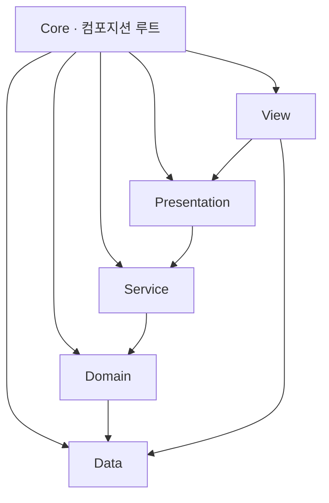

# ECLIPSE — 기술 문서

코드만 읽어서는 드러나지 않는 설계 결정과 그 근거를 적은 문서입니다. 구현 상세는 [README](./README.md)와 코드를 참고하시면 됩니다.

**목차**
1. [아키텍처](#1-아키텍처)
2. [결정론적 전투](#2-결정론적-전투)
3. [챕터 진행 — 상태기계와 확률](#3-챕터-진행--상태기계와-확률)
4. [성장과 영속](#4-성장과-영속)
5. [UI 계층](#5-ui-계층)
6. [테스트 전략](#6-테스트-전략)
7. [설계 결정 요약](#7-설계-결정-요약)

---

## 1. 아키텍처

의존 방향을 `Core → View → Presentation → Service → Domain → Data`로 제한했습니다. `Core`만 전 레이어를 참조하고, `Domain`은 Unity 엔진과 프레임워크에 의존하지 않는 순수 C#이라 컨테이너 없이 `new`로 만들어 테스트합니다.

| 어셈블리 | 참조(내부) | 외부 |
|---|---|---|
| `Eclipse.Data` | — | 없음 |
| `Eclipse.Domain` | Data | UniTask |
| `Eclipse.Service` | Domain, Data | UniTask |
| `Eclipse.Presentation` | Service, Domain, Data | UniTask, R3 |
| `Eclipse.View` | Presentation, Domain, Data | VContainer, R3, UGUI, TMP, DOTween |
| `Eclipse.Core` | 전부 | VContainer, R3 |

DI 스코프는 세 단계입니다. 앱 전역의 `AppLifetimeScope` 아래에 로비용 `GameLifetimeScope`를 두고, 그 아래에 챕터용 `BattleLifetimeScope`를 만듭니다. 전투 객체 그래프(파이프라인·리졸버·팩토리)와 챕터 진행 상태를 마지막 스코프에 모았습니다.

`BattleLifetimeScope`가 해제되면 챕터 상태도 함께 폐기됩니다. 중간 상태를 어디에도 직렬화하지 않으므로 앱을 다시 켜도 진행하던 도전을 복구하거나 정산하지 않습니다.

경계는 타입 수준에서도 지킵니다. `Data`는 DOTween을 참조하지 않으므로 `EffectSpec`이 자체 `EffectEase` enum을 정의하고, `View`에서 `DG.Tweening.Ease`로 옮깁니다. 하위 레이어가 상위 프레임워크를 끌어오지 않게 하려는 조치입니다.

---

## 2. 결정론적 전투

같은 시드와 같은 로스터에 같은 입력을 주면 전투 결과가 재현됩니다. 코드와 데이터가 같은 버전이라는 전제 아래 성립하는 성질이고, 회귀 테스트는 이 성질 위에 서 있습니다.

### 난수

`System.Random`은 실행 환경과 버전에 따라 수열이 달라질 수 있어 xorshift128+(Vigna 2014)를 직접 구현했습니다. 구간 정수 추첨에는 64비트 결과의 상위 32비트를 써서 Lemire 방식(multiply-shift + 기각)으로 모듈로 편향을 제거합니다. 상위 비트를 쓰는 이유는 xorshift128+의 하위 비트에 선형성 약점이 있기 때문입니다.

시드 하나에서 용도별 스트림을 파생시킵니다. 전투는 데미지와 타겟팅, 챕터는 인카운터·변이·문·카드로 나뉘고, 방별 전투 시드도 챕터 시드에서 인덱스로 파생합니다.

스트림을 나눈 이유는 튜닝을 해도 다른 수열이 흔들리지 않게 하려는 것입니다. 변이 확률을 조정하면 변이 롤 소비량이 달라지는데, 한 스트림을 공유하면 그 순간 적 마릿수와 종류 선택까지 밀려 회귀 테스트의 기대값이 통째로 깨집니다. 확률이 0%인 경우에도 개체마다 난수를 한 번 소비하는 것도 같은 이유입니다. 조건부로 건너뛰면 확률 설정이 수열 길이를 바꿉니다.

### ATB 스케줄러

SPD 게이지를 고정소수점 `long`으로 관리하고, 다음 행동자는 도달 시간의 정수 교차곱으로 비교해 판정합니다. 부동소수점 연산을 쓰지 않으므로 플랫폼이나 컴파일러에 따라 결과가 갈릴 여지를 줄였습니다. 행동 후에는 게이지 초과분을 다음 턴으로 이월해 행동 빈도가 SPD에 정확히 비례합니다.

### 데미지 계산

공격력과 스킬 계수로 기본 피해를 구한 뒤 비율 방어 경감 `atk / (atk + def × defenseK)`을 적용하고, 그다음 치명타와 분산을 계산합니다. 비율식이라 DEF가 아무리 높아도 피해가 0이 되지 않습니다. 난수도 이 순서에서만 소비합니다.

실제 데미지와 최소 데미지 추정(`EstimateMinDamage`, 난수를 쓰지 않음)이 같은 `Compute` 본문을 공유합니다. 덕분에 확정 처치 판정과 실제 피해가 어긋날 수 없습니다.

스킬 강화 배수 `1 + 0.10×(level−1)`는 유닛 조립 시점에 `SkillRuntime`에 심고, 위력형 효과 네 종(`Damage`/`Heal`/`Dot`/`Regen`)의 `value`에만 곱합니다. `Buff`·`Debuff`·`Shield`의 `value`는 증감률이라 배수를 곱하면 기획이 정한 비율 자체가 어긋납니다.

이 배수에는 소비 지점이 둘이었습니다. `SkillExecutor` 외에 확정 처치 판정의 `PreviewDamage`도 `effect.value`를 읽는데, 여기에 배수를 적용하지 않으면 피해 숫자는 정상으로 나오면서 오토 AI만 강화된 스킬의 처치 가능성을 못 알아봅니다. 전투가 멈추지 않고 대상 선택 품질만 떨어지는 결함이라 발견이 늦었습니다. 리뷰에서 잡은 뒤 두 지점 모두에 배수를 적용하고 회귀 테스트를 추가했으며, 수정 전 코드에서 그 테스트가 실패하는 것도 확인했습니다.

### 타겟 결정 계층

아군 오토와 적 AI가 하나의 정책 클래스를 공유하고, 차이는 프로파일 값으로만 냅니다. 위에서부터 평가해 처음 걸리는 층에서 타겟이 확정됩니다.

1. 도발자가 있으면 후보를 도발자로 좁힙니다.
2. 이번 공격의 최소 피해로도 쓰러지는 대상이 있으면 마무리합니다.
3. 속성 상성이나 어그로를 얹을 확장 자리입니다. 현재는 비어 있습니다.
4. 남으면 아군은 최저 HP 대상, 적은 저HP에 약한 가중을 준 무작위를 고릅니다.

2번의 실행 확률 `LethalChance`는 아군 1.0, 적 0.6입니다. 적이 항상 마무리를 선택하지 않게 해 회복으로 받아칠 여지를 남긴 값입니다. 수동과 오토 모두 `TargetResolver`를 거치므로 선택한 타겟과 실제 타격 타겟이 항상 일치합니다.

---

## 3. 챕터 진행 — 상태기계와 확률

### 진행을 소유하는 쪽

`ChapterRunSession`이 현재 방과 챕터 시드, 슬롯별 버프 합, 보류 보상, 수입 장부를 보관합니다. `ChapterRunFlow`는 그 상태를 바탕으로 제시물을 R3로 내보내고 화면의 보고만 받습니다. 방 전진, 인카운터 생성, 보류 보상의 지급과 몰수, 정산, 저장, 씬 이탈이 전부 이 클래스에서 일어납니다. 씬 글루(`ChapterRunDriver`)는 제시물을 구독해 페이드·배경 스왑·전투 재조립·팝업을 처리하고 선택을 되돌려 보고할 뿐입니다.

화면 보고에는 전이 횟수를 담은 토큰을 붙입니다. 더블 탭, 늦은 애니메이션 콜백, 이미 닫힌 팝업의 지연 보고가 실제로 도착하는 구간이기 때문입니다. 스텝 종류로만 검증하면 세 번째 문 지점의 콜백이 네 번째 지점 도중에 도착하는 경우를 거르지 못하므로, 종류가 아니라 전이 횟수를 기준으로 삼았습니다.

화면은 고른 자리 번호만 전달하고, 상태기계는 해당 카드와 문 보상을 제시물에서 직접 꺼냅니다. 보상이 화면을 왕복하지 않으니 값을 대조할 일도 없어집니다.

종료 처리는 순서를 고정했습니다. 미확정 보상을 먼저 몰수하고 정산액과 클리어 기록을 확정한 다음, 재화를 지급하고 저장한 뒤 결과 팝업을 띄우고 로비로 돌아갑니다. 지급과 저장을 UI 대기 앞에 끝냈기 때문에 정산 팝업에서 앱이 죽어도 확정된 재화가 남습니다. 커밋 플래그로 이중 커밋도 막았습니다.

전멸과 클리어는 같은 정산 경로를 탑니다. 포기하면 정산하지 않고 적립분도 폐기합니다. 포기 요청에만 토큰을 검사하지 않는데, 확인 팝업이 떠 있는 사이 스텝이 넘어가면 포기가 조용히 무효가 되기 때문입니다. 대신 포기를 확정할 때 토큰을 직접 올려 이미 나가 있는 보고를 무효화합니다.

오토 전투는 확인 팝업의 존재를 모릅니다. 묻는 사이 방이 끝나면 정규 커밋이 먼저 서서 포기했는데 정산을 받는 결과가 나오므로, 확인이 떠 있는 동안 `Time.timeScale`을 0으로 잡습니다. 연출이 전부 DOTween이고 unscaled 지정이 없다는 것을 확인하고 고른 방법입니다.

### 확률 표면

| 표면 | 구현 |
|---|---|
| 인카운터 | 깊이에 따라 적 수를 정하고, 슬롯별 적과 개체별 변이를 차례로 추첨합니다. 정예 전투는 같은 생성 결과의 마릿수와 변이를 덮어써서 만듭니다 |
| 약속의 문 | 문 8종을 비복원 가중 추첨합니다. 캐릭터 문은 파티 슬롯마다 한 항목으로 갈라 라인업을 세웁니다 |
| 미드보스 문 | 세 번째 문 지점에서는 후보 4종을 한 번에 뽑아 두 개를 미드보스 문의 보상 2종으로 묶고, 나머지 둘을 일반 문으로 배분합니다. 화면에 서는 문은 미드보스 문 1개와 일반 문 2개로 모두 3개입니다 |
| 버프 카드 | 등급 가중 비복원 추첨입니다. 후보는 문에 따라 갈립니다(캐릭터 문은 범용 카드와 그 캐릭터의 유니크, 저주 문은 저주 카드) |
| 재화 금액 | 선택 시점에는 종류와 깊이만 보류하고 공개 시점에 굴립니다. 반올림은 마지막에 한 번만 합니다 |

RNG 인터페이스에는 구간 정수 추첨 하나만 둡니다. 가중 추첨과 비복원 추첨은 계약에 넣지 않고 위 계층이 조립합니다. 계약이 얇아야 가짜 RNG로 "이 몹, 이 변이"를 지정하는 표적 테스트를 세울 수 있습니다.

커먼·레어·에픽·유니크 네 등급 값으로 카탈로그 35행의 가중치를 계산합니다. 행마다 수기로 적으면 실수가 나기 쉽고, 실제 튜닝도 등급 단위로 일어납니다. 카드를 늘릴 때는 코드를 고치지 않고 행만 추가하면 됩니다.

이미 보유한 유니크 카드는 후보 목록을 만들 때 제외합니다. 재정규화는 남은 후보의 가중 합을 다시 재는 기존 루프가 그대로 처리하므로 추첨 코드는 손대지 않습니다. 배제 규칙이 늘어도 한 함수에만 쌓입니다.

한 문 지점에 필요한 후보는 한 번의 추첨으로 뽑습니다. 자리를 나눈 뒤 자리마다 뽑으면 비복원이 호출 안에서만 유지돼 같은 보상이 한 지점에 두 번 뜹니다.

난수 호출 순서도 테스트 대상입니다. 가중 추첨 네 번 뒤에 자리 굴림 한 번이라는 순서가 뒤집히면 첫 난수를 자리가 먹어 문 네 개가 한 칸씩 밀립니다. 결정적 난수를 쓰는 시스템에서는 무엇을 뽑았는지보다 몇 번째 난수를 누가 가져갔는지가 더 자주 문제가 됩니다. 그래서 값을 순서대로 돌려주는 스크립트 RNG로 소비 순서 자체를 고정했습니다.

### 유니크 카드가 스킬에 적용되는 방식

유니크 5장은 스탯 대신 해당 캐릭터의 스킬 하나에 효과 한 건을 덧붙입니다. 기획 문서가 나눈 멀티히트·추가 대상·라이더는 실행 시점에 모두 효과 목록의 항목 하나로 처리됩니다. 그래서 도구 종류를 담는 필드나 enum은 두지 않았습니다.

수정본은 `SkillRuntime`이 소유합니다. `SkillSO`는 여러 유닛이 공유하는 에셋이라 실행 중에 고치면 플레이를 끝내도 에디터 세션에 남습니다. 수정이 없는 스킬은 원본 목록을 그대로 가리키므로 방마다 사본이 쌓이지 않습니다.

---

## 4. 성장과 영속

### 성장 3축

레벨업은 골드, 스킬 강화는 골드와 교본을 씁니다. 돌파는 가챠 중복이 재료라 공급 전까지 잠겨 있습니다. 세 서비스 모두 상한을 검사하고 재화를 차감한 뒤 값을 저장하는 같은 골격이지만, 공통 부모나 제네릭 트랜잭션 타입은 만들지 않았습니다. 셋을 합쳐도 중복이 몇 줄이고 결제 재화 수와 가드 조건이 서로 달라, 추상화가 얻는 것보다 차지하는 자리가 큽니다.

골드와 교본을 모두 가졌는지 먼저 검사한 뒤 함께 차감해 결제 원자성을 보장합니다. 차례로 차감하면 골드만 빠지고 교본에서 실패하는 반쪽 결제가 생깁니다.

최종 스탯은 레벨·돌파·버프 곱을 `BuildAllyStats` 한 곳에서만 접고 마지막에 한 번 반올림합니다. 계산처가 둘이면 중간 반올림 차이 때문에 화면 표시와 전투 수치가 갈라집니다.

### 화면 동기화

성장 트랜잭션이 성공했을 때만 변경 신호를 보내고, 해당 캐릭터를 표시하는 ViewModel들이 신호를 받아 각자 값을 다시 읽습니다. `Refresh()`를 두지 않은 것은 호출 시점을 누가 아느냐의 문제 때문입니다. 성장 화면이 상세 화면의 갱신 시점까지 책임지는 구조를 피하려 했습니다.

신호는 값을 싣지 않고 바뀐 캐릭터 참조만 넘깁니다. 무엇이 얼마나 바뀌었는지는 구독자가 도메인에서 직접 읽습니다. 값을 실으면 성장 축이 늘 때마다 신호 모양이 바뀝니다.

`ScreenManager.Push`는 스택에 이미 있는 화면으로 돌아갈 때 `OnEnter`를 다시 부르지 않습니다. 성장 화면에서 뒤로 나와 상세 화면으로 돌아오는 경로가 정확히 이 경우라, `OnEnter`에서 값을 한 번 대입하는 방식이었다면 옛 값이 남았을 겁니다. 구독으로 바꾼 실질적인 이유입니다.

### 세이브

JSON 한 파일(`persistentDataPath/player.json`)에 보유 캐릭터, 재화 3종, 챕터 클리어 기록, 파티 4칸을 저장합니다. 에셋 참조 대신 문자열 id만 저장하므로 나중에 Addressables를 도입해도 세이브 계층은 그대로입니다.

디스크 DTO와 실행 중 반응형 홀더는 분리했습니다. 클라우드 세이브를 붙이게 되면 이 JSON이 그대로 요청 본문이 됩니다.

버전이 맞지 않으면 마이그레이션 없이 신규 계정으로 수렴시킵니다. `JsonUtility`는 스키마가 바뀌면 조용히 일부만 역직렬화하기 때문에, 반쪽 상태로 굴러가는 것보다 리셋이 안전합니다. 배포된 세이브가 없는 포트폴리오 빌드라서 고를 수 있는 정책이고, 잊은 것이 아니라 정한 것임을 남기려고 정책 자체를 테스트로 못박았습니다.

WebGL은 `File.WriteAllText`가 브라우저 메모리까지만 쓰기 때문에 매 저장 후 `.jslib`의 `FS.syncfs`를 호출하고, 탭 종료 훅이 없어 변경 시점에 즉시 저장한 뒤 포커스 해제를 안전망으로 씁니다. iOS는 앱 종료가 quit이 아니라 suspend라 `OnApplicationQuit`이 오지 않으므로 `OnApplicationPause(true)`에서 저장하고, 매 쓰기 후 iCloud 제외 플래그를 다시 적용합니다.

저장 실패는 삼키고 로그만 남깁니다. 저장이 게임을 죽이면 안 됩니다. 로드 실패는 전부 신규 계정으로 수렴시킵니다.

---

## 5. UI 계층

ViewModel이 R3 스트림으로 상태를 노출하고 View는 `Subscribe().AddTo(this)`로 구독만 합니다. `BattleViewModel`은 턴마다 한 번 발화하는 `Subject` 하나에서 액션 수, 승패, 타임라인, 유닛별 HP와 쿨다운을 전부 파생하므로 폴링이 없습니다.

화면은 스택 기반 `ScreenManager`, 팝업은 모달 `PopupManager`가 맡습니다. 전환이 비동기라 재진입 가드가 필요했고, 가드가 없을 때 나타나는 증상(연타로 같은 화면이 두 번 쌓임)을 테스트로 고정했습니다.

전투 연출은 배틀러가 스스로 재생합니다. 월드 오브젝트는 씬 액터이고 MVVM은 UI만 다룹니다. 배속과 연출 대기는 `Func<CancellationToken, UniTask>` 이음새로 도메인 턴 루프와 만납니다.

---

## 6. 테스트 전략

NUnit EditMode 테스트 속성 360개, 47파일입니다. 도메인 로직과 상태기계 전체 흐름, 데이터 드리프트를 각각 검증합니다.

도메인 테스트는 컨테이너도 씬도 없이 전투(ATB·데미지·상태이상·타겟 정책)와 챕터 로직(문/카드 추첨·인카운터·정산·시드)을 검증합니다.

상태기계 테스트는 화면 없이 방 7개와 문 지점 5곳, 미드보스 두 갈래, 정산까지 한 판을 끝까지 돌립니다. 낡은 토큰을 무시하는지, 커밋이 한 번만 서는지도 여기서 확인합니다.

데이터 드리프트 테스트는 카탈로그(문·버프 카드·적 스탯·스킬 설명문·VFX 소스)와 코드 기대치가 어긋나면 실패합니다. 검증 어서트를 생성자에 모아 로드 시점에 한 번 터뜨립니다. 데이터 실수가 방마다 다른 곳에서 터지면 원인을 찾기 어렵습니다.

확률 시스템은 두 층으로 봅니다. 난수를 인터페이스 뒤에 두고 스텁으로 굴림 값을 지정하는 표적 테스트가 지정한 난수에서의 결과를 검증하고, 실물 시드로 도는 테스트가 분포와 범위, 스트림 격리를 검증합니다.
