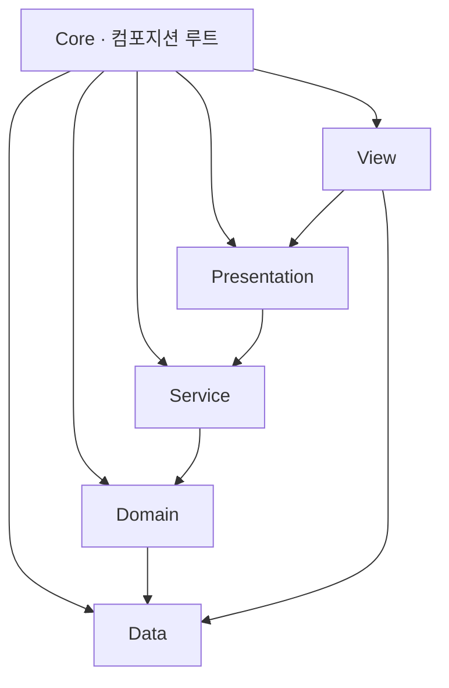

# ECLIPSE — 기술 문서

> [README](./README.md)의 아키텍처·시스템을 **왜 이렇게 설계했는지** 중심으로 정리한 문서입니다.
> 상세 구현은 코드로 확인할 수 있으므로, 여기서는 핵심 결정과 그 이유만 다룹니다.

**목차**
1. [아키텍처](#1-아키텍처)
2. [핵심 기술](#2-핵심-기술)
3. [설계 결정 (ADR)](#3-설계-결정-adr)

---

## 1. 아키텍처

의존성은 **안쪽으로만** 흐릅니다(`Core`만 전 레이어를 참조). `Domain`은 Unity 엔진·프레임워크에 의존하지 않는 순수 C#이라, 컨테이너 없이 `new`로 만들어 테스트할 수 있습니다.

| 어셈블리 | 참조(내부) | 외부 |
|---|---|---|
| `Eclipse.Data` | — | 없음 |
| `Eclipse.Domain` | Data | UniTask |
| `Eclipse.Service` | Domain, Data | UniTask |
| `Eclipse.Presentation` | Service, Domain, Data | R3 |
| `Eclipse.View` | Presentation, Data | VContainer, R3, UGUI, TMP, DOTween |
| `Eclipse.Core` | 전부 | VContainer, R3 |

- **DI (VContainer)**: 씬별 3계층 `LifetimeScope`(App 루트 → Game 아웃게임 → Battle 인게임). 전투 객체 그래프(파이프라인·리졸버·팩토리) 조립을 `BattleLifetimeScope` 한곳에 모읍니다.
- **경계 지키기**: `Data`는 DOTween을 참조하지 않으므로, `EffectSpec`이 자체 `EffectEase` enum을 정의하고 `View`에서 `DG.Tweening.Ease`로 변환합니다 — 하위 레이어가 상위 프레임워크를 끌어오지 않게.

---

## 2. 핵심 기술

### 결정론적 전투

**같은 시드 + 같은 로스터면 결과가 항상 똑같이 재현된다**는 것이 전투 시스템의 핵심 원칙입니다. 이를 위해:

- **난수**: `System.Random`은 런타임·버전 간 같은 수열을 보장하지 않아, **xorshift128+**(Vigna 2014)를 직접 구현했습니다. 타겟 선택용 난수는 데미지용과 **별도 스트림**으로 분리(`seed ^ 0x7A16E7`)해, 타겟 선택 난수가 데미지 난수 순서를 밀지 않도록 했습니다 → 데미지 회귀 테스트가 흔들리지 않음.
- **ATB 스케줄러**: SPD 게이지를 **고정소수점 `long`**으로 관리하고, 다음 행동자는 **정수 교차곱 비교**로 판정합니다. 부동소수점을 배제해 플랫폼 간 결정론을 확보했습니다. 행동 후 게이지 초과분을 다음 턴으로 이월(캐리오버)해 행동 빈도가 SPD에 정확히 비례합니다.

### 데미지 단일 경로

`raw = atk × skillPower` → 비율 경감 `atk / (atk + def × defenseK)` → 치명 → variance 순으로 계산합니다(비율식이라 DEF가 데미지를 0으로 만들지 못함). 실제 데미지와 최소 데미지 추정(`EstimateMinDamage`, 난수 미소비)이 **같은 `Compute` 본문을 공유**하므로, 막타(확정 처치) 판정과 실제 데미지가 어긋날 일이 없습니다.

### 타겟 선택 정책

아군 오토와 적 AI가 **하나의 정책 클래스를 공유**하고, 차이는 프로파일 값으로만 냅니다. 우선순위 사다리를 위에서부터 평가해 처음 걸리는 층에서 타겟을 확정합니다:

1. **도발** — 도발자가 있으면 후보를 그쪽으로 좁힘.
2. **막타(확정 처치)** — 이번 공격의 최소 데미지로도 죽는 대상이 있으면 마무리. 실행 확률 `LethalChance`는 아군 1.0(항상), 적 0.6(**일부러 불완전** — 힐러 카운터플레이 여지).
3. **확장 훅** — 속성 상성·어그로 등. 현재 no-op.
4. **기저** — 아군은 최저 HP 대상, 적은 저HP 약가중 랜덤.

수동·오토 모두 `TargetResolver`를 거치므로 **"선택한 타겟 = 실제 타격 타겟"**이 보장됩니다.

### 데이터 주도

캐릭터·적·스킬·성장·이펙트·밸런스 상수를 전부 ScriptableObject로 분리해, 코드 재컴파일 없이 수치를 조정할 수 있습니다(`defenseK`·`variance`·`enemyLethalChance` 등 밸런스 노브 포함). 성장 곡선은 `base × (1 + 0.07 × (lvl−1))`, 최대 30레벨.

### MVVM + R3

ViewModel이 R3 스트림으로 상태를 노출하고, View는 `Subscribe().AddTo(this)`로 구독만 합니다(로직 없음). `BattleViewModel`은 **턴당 한 번 발화하는 단일 `Subject` 하나**에서 액션 수·승패·타임라인·유닛별 HP/쿨다운을 전부 파생합니다(폴링 없음).

---

## 3. 설계 결정 (ADR)

| 결정 | 왜 |
|---|---|
| **VContainer** | 씬 스코프 계층·팩토리로 전투 그래프 조립을 한곳에 모으고, 도메인은 컨테이너 비종속으로 유지(테스트 용이). |
| **MVVM** | View를 얇게 유지하고 상태·로직을 ViewModel로 분리해, UI 없이도 로직을 테스트. |
| **R3** | 상태 변화를 스트림으로 노출, View는 구독만 → 폴링 제거·바인딩 일원화. |
| **ATB(고정소수점)** | 실시간 게이지 감각 + 부동소수점 배제로 플랫폼 간 결정론 확보. |
| **데미지 단일 경로** | 실제 데미지와 최소 데미지 추정이 같은 본문을 공유 → 막타 판정과 실데미지 불일치 차단. |
| **타겟 정책 공유** | 아군 오토·적 AI가 한 정책을 공유하고 프로파일로만 분기 → 규칙 중복·불일치 제거. |
| **정의/런타임 분리** | SO(정의)와 런타임 상태(`SkillRuntime`/`Combatant`)를 분리해 SO를 불변 데이터로 유지. |

> 원본 ADR·학습 노트는 비공개 개인 문서로 관리합니다.
