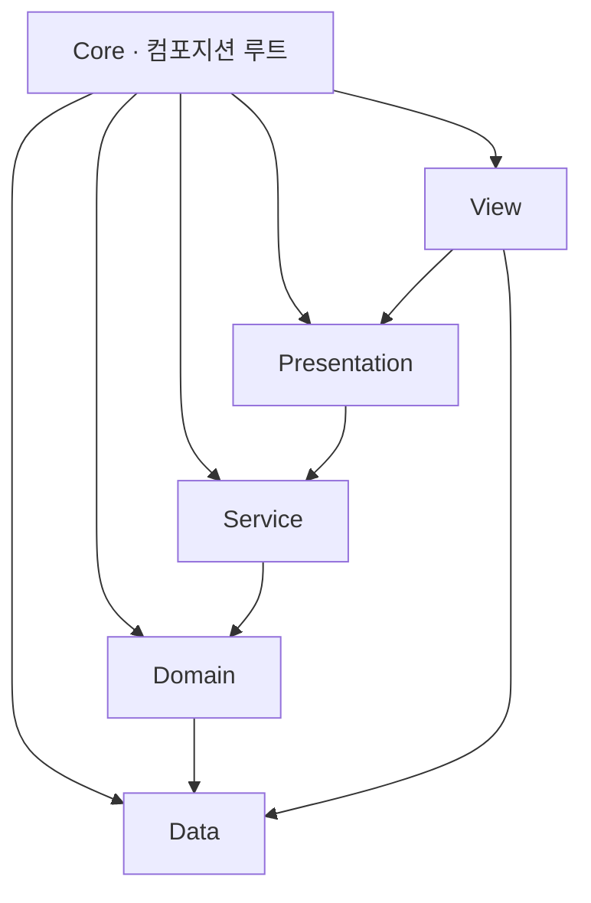

# ECLIPSE — 기술 문서

> [README](./README.md)의 아키텍처·시스템을 **왜 이렇게 설계했는지** 중심으로 정리한 문서입니다.
> 상세 구현은 코드로 확인할 수 있으므로, 여기서는 결정과 근거만 다룹니다.

**목차**
1. [아키텍처](#1-아키텍처)
2. [결정론적 전투](#2-결정론적-전투)
3. [챕터 런 — 상태기계와 확률](#3-챕터-런--상태기계와-확률)
4. [성장과 영속](#4-성장과-영속)
5. [UI 계층](#5-ui-계층)
6. [테스트 전략](#6-테스트-전략)
7. [설계 결정 (ADR)](#7-설계-결정-adr)

---

## 1. 아키텍처

의존성은 **안쪽으로만** 흐릅니다(`Core`만 전 레이어를 참조). `Domain`은 Unity 엔진·프레임워크에 의존하지 않는 순수 C#이라 컨테이너 없이 `new`로 만들어 테스트합니다.

| 어셈블리 | 참조(내부) | 외부 |
|---|---|---|
| `Eclipse.Data` | — | 없음 |
| `Eclipse.Domain` | Data | UniTask |
| `Eclipse.Service` | Domain, Data | UniTask |
| `Eclipse.Presentation` | Service, Domain, Data | UniTask, R3 |
| `Eclipse.View` | Presentation, Domain, Data | VContainer, R3, UGUI, TMP, DOTween |
| `Eclipse.Core` | 전부 | VContainer, R3 |

**DI 스코프 3계층.** `AppLifetimeScope`(루트, 씬 전환에도 유지) → `GameLifetimeScope`(로비) → `BattleLifetimeScope`(챕터 런). 전투 객체 그래프(파이프라인·리졸버·팩토리)와 런 상태를 `BattleLifetimeScope` 한곳에 모읍니다. 런 상태를 여기 Scoped로 둔 덕에 **씬 언로드가 곧 런 폐기**입니다 — "앱 종료 = 실패, 정산 0"이라는 기획 규칙이 직렬화 코드 0줄로 성립합니다.

**경계 지키기.** `Data`는 DOTween을 참조하지 않으므로 `EffectSpec`이 자체 `EffectEase` enum을 정의하고 `View`에서 `DG.Tweening.Ease`로 옮깁니다. 하위 레이어가 상위 프레임워크를 끌어오지 않게 하려는 것입니다.

---

## 2. 결정론적 전투

**같은 시드 + 같은 로스터면 결과가 항상 같게 재현된다.** 이것이 전투와 런 전체를 관통하는 원칙이고, 회귀 테스트가 성립하는 근거입니다.

### 난수 — 알고리즘과 스트림 분리

`System.Random`은 런타임·버전 간 같은 수열을 보장하지 않아 **xorshift128+**(Vigna 2014)를 직접 구현했습니다. 구간 정수 추첨은 64비트 결과의 **상위 32비트**를 써서 Lemire 기법(multiply-shift + 기각)으로 모듈로 편향을 제거합니다 — xorshift128+는 하위 비트에 선형성 약점이 있습니다.

시드 하나에서 용도별 스트림을 파생시킵니다. 전투는 데미지와 타겟팅, 런은 인카운터·변이·문·카드로 나뉘고, 방별 전투 시드도 런 시드에서 인덱스로 파생합니다.

스트림을 나누는 이유는 튜닝 내성입니다. 변이 확률을 만지면 변이 롤 소비량이 달라지는데, 한 스트림을 공유하면 그 순간 마리수·몹 선택 수열까지 밀려 회귀 테스트의 기대값이 통째로 깨집니다. 같은 이유로 **확률이 0%여도 롤은 마리당 1회 소비**합니다 — 건너뛰면 튜닝 수치가 수열 길이를 바꿉니다.

### ATB 스케줄러

SPD 게이지를 **고정소수점 `long`**으로 관리하고, 다음 행동자는 도달 시간의 **정수 교차곱 비교**로 판정합니다. 부동소수점을 배제해 플랫폼 간 결정론을 확보했습니다. 행동 후 게이지 초과분을 다음 턴으로 이월해 행동 빈도가 SPD에 정확히 비례합니다.

### 데미지 단일 경로

`raw = atk × skillPower` → 비율 경감 `atk / (atk + def × defenseK)` → 치명 → 분산 순으로 계산합니다(비율식이라 DEF가 데미지를 0으로 만들지 못합니다). 실제 데미지와 최소 데미지 추정(`EstimateMinDamage`, 난수 미소비)이 **같은 `Compute` 본문을 공유**하므로 막타 판정과 실데미지가 어긋날 수 없습니다.

스킬 강화 배수(`1 + 0.10×(level−1)`)는 유닛 조립 시점에 `SkillRuntime`에 심고, 위력형 4종(`Damage`/`Heal`/`Dot`/`Regen`)의 `value`에만 곱합니다. `Buff`/`Debuff`/`Shield`의 `value`는 증감률이라 곱하면 기획이 정한 비율이 어긋납니다.

이 배수에는 소비처가 둘이었습니다. `SkillExecutor` 말고도 막타 판정의 `PreviewDamage`가 `effect.value`를 읽는데, 여기 배수를 안 먹이면 피해 숫자는 맞게 나오면서 **강화된 스킬로 확실히 죽일 수 있는 적을 오토 AI가 못 알아봅니다**. 실패가 아니라 선택 품질 저하라 눈에 띄지 않습니다. 리뷰에서 잡아 소비 지점에서 곱하도록 고쳤고, 회귀 테스트를 붙인 뒤 수정을 되돌려 그 테스트만 실패하는 것까지 확인했습니다.

### 타겟 결정 계층

아군 오토와 적 AI가 **하나의 정책 클래스를 공유**하고, 차이는 프로파일 값으로만 냅니다. 사다리를 위에서부터 평가해 처음 걸리는 층에서 타겟을 확정합니다.

1. **도발** — 도발자가 있으면 후보를 그쪽으로 좁힙니다.
2. **막타** — 이번 공격의 최소 데미지로도 죽는 대상이 있으면 마무리합니다. 실행 확률 `LethalChance`는 아군 1.0, 적 0.6 — **일부러 불완전하게** 두어 힐러 카운터플레이 여지를 남겼습니다.
3. **확장 훅** — 속성 상성·어그로 자리. 현재 no-op.
4. **기저** — 아군은 최저 HP 대상, 적은 저HP 약가중 랜덤.

수동·오토 모두 `TargetResolver`를 거치므로 **선택한 타겟과 실제 타격 타겟이 항상 같습니다.**

---

## 3. 챕터 런 — 상태기계와 확률

### 상태기계가 진행을 소유한다

`ChapterRunSession`이 방 커서·버프 합·에스크로·런 시드·수입 장부를 들고, `ChapterRunFlow`가 제시물을 R3로 내보내고 화면의 보고만 받습니다. 방 전진, 인카운터 생성, 에스크로 지급·몰수, 정산, 저장, 씬 이탈이 전부 여기서만 일어납니다. 씬 글루(`ChapterRunDriver`)는 제시물을 구독해 페이드·배경 스왑·전투 재조립·팝업을 하고 선택을 되돌려 보고할 뿐입니다.

**전이 토큰 멱등.** 더블 탭, 늦은 애니메이션 콜백, 닫힌 팝업의 지연 보고가 실제로 도착하는 구간입니다. 스텝 *종류*로 검증하면 같은 종류의 이전 스텝(문 지점 ③의 콜백이 ④ 도중 도착)을 못 거르므로, **전이 횟수**를 토큰으로 발급해 대조합니다.

**송신자를 신뢰하지 않습니다.** 토큰이 맞아도 화면이 만들어 낸 값일 수 있습니다. 카드는 보고된 구조체가 아니라 *제시한* 카드를 붙이고, 문은 아예 값을 받지 않고 **제시물의 자리 번호만** 받아 보상을 상태기계가 직접 꺼냅니다. 보상이 화면을 왕복하지 않으면 대조할 일도 없어집니다.

**종료 커밋 순서를 고정했습니다.** 몰수 → 정산 계산 → (승리만) 클리어 기록 → 지급 → 저장 1회 → 팝업 → 복귀. 지급과 저장을 UI 대기 앞에 끝내 정산 팝업에서 앱이 죽어도 확정 재화가 유실되지 않고, 커밋 플래그로 이중 커밋이 막힙니다.

종료 경로는 둘이지만 커밋을 타는 쪽은 하나입니다. 전멸은 런을 *끝낸* 것이라 적립분과 정산을 받고, 포기(`[나가기]`)는 *버린* 것이라 둘 다 소멸합니다. 포기에만 토큰 검사를 두지 않은 것도 의도입니다 — 확인 팝업이 떠 있는 사이 스텝이 넘어가면 포기가 조용히 무효가 됩니다. 대신 포기가 토큰을 직접 올려 이미 나가 있는 보고를 무효화합니다.

오토 전투는 확인 팝업을 모릅니다. 묻는 사이 방이 끝나면 정규 커밋이 먼저 서서 "포기했는데 정산을 받는" 결과가 나오므로, 확인 동안 `Time.timeScale`을 0으로 잡습니다. 연출이 전부 DOTween이고 unscaled 지정이 없다는 것을 확인하고 고른 방법입니다.

### 확률 표면

| 표면 | 구현 |
|---|---|
| 인카운터 | 깊이별 마리수 → 슬롯별 풀 → 마리당 변이. 정예는 새 경로가 아니라 마리수·변이를 덮는 오버레이 |
| 약속의 문 | 문 8종 비복원 가중 추첨. 캐릭터 문은 파티 슬롯마다 한 항목으로 갈라 라인업을 세운다 |
| 미드보스 문 | 지점 하나를 4종 한 번에 추첨해 0·3번째를 미드보스 보상 2종, 1·2번째를 일반 문으로 스네이크 배분 |
| 버프 카드 3택 | 등급 가중 비복원. 후보는 문에 따라 갈린다(캐릭터 문 = 범용 + 그 캐릭터 유니크, 저주 문 = 저주 카드) |
| 재화 금액 | 선택 시점엔 종류·깊이만 보류, 공개 시점에 롤. 반올림 마지막 1회 |

**RNG 계약은 정수 롤 하나뿐입니다.** 가중 추첨과 비복원 추첨은 계약에 넣지 않고 위 계층이 조립합니다. 계약이 얇아야 가짜 RNG 스텁으로 "이 몹, 이 변이"를 정확히 재현하는 표적 테스트가 섭니다.

**등급 가중은 행이 아니라 노브 넷에 있습니다.** 카탈로그 35행마다 가중치를 적는 대신 커먼/레어/에픽/유니크 네 값에서 파생합니다. 수기 입력에서 가중치는 실수의 원천이고, 튜닝은 행이 아니라 등급 단위로 일어납니다. 카드 추가는 코드 무수정 행 추가입니다.

**배제는 추첨이 아니라 후보 구성에 넣습니다.** 유니크 캐릭터당 1장 상한은 후보 풀에서 보유 id를 걸러 내는 것으로 끝나고, 재정규화는 남은 후보로 가중 합을 다시 재는 기존 루프가 그대로 합니다. 배제 규칙이 늘어도 추첨 코드는 안 바뀝니다.

**한 지점은 한 번의 추첨으로 뽑습니다.** 자리를 나눈 뒤 자리마다 뽑으면 비복원이 호출 안에서만 유지돼 같은 보상이 한 지점에 두 번 뜹니다.

**난수 소비 순서가 계약입니다.** 가중 추첨 4회 뒤에 자리 굴림 1회 — 순서가 뒤집히면 첫 난수를 자리가 먹어 문 4개가 한 칸씩 밀립니다. 결정적 난수를 쓰는 시스템에서 버그는 값이 아니라 순서에서 납니다. 그래서 스크립트 RNG(값을 순서대로 돌려주는 가짜 난수)로 소비 순서 자체를 테스트에 고정했습니다.

### 유니크 카드 — 런 상태가 스킬을 고치는 브리지

유니크 5장은 스탯이 아니라 그 캐릭터의 **스킬 하나에 효과 1건을 덧붙입니다.** 기획은 도구를 멀티히트·추가 대상·라이더 셋으로 나눴지만, 코드에서 멀티히트는 `Damage` 효과 1건이고 라이더는 그 밖의 타입 1건입니다. 효과 목록을 순회하는 실행기는 둘을 구분하지 못하고 구분할 이유도 없어서, 도구 종류를 담는 필드도 enum도 만들지 않았습니다. 기획 용어를 그대로 타입으로 옮기면 코드에 쓸모없는 분기가 생깁니다.

수정본은 `SkillRuntime`이 소유합니다. `SkillSO`는 여러 유닛이 공유하는 에셋이라 런타임에 고치면 플레이를 끝내도 에디터 세션에 남습니다. 수정이 없는 스킬은 원본 리스트를 그대로 가리켜 방마다 사본이 쌓이지 않습니다.

---

## 4. 성장과 영속

### 성장 3축

레벨업(골드), 스킬 강화(골드+교본), 돌파(가챠 중복 — 공급 전까지 잠금). 세 서비스가 "상한 가드 → 결제 → 증가·저장" 3단을 각자 복제합니다. 공통 부모나 제네릭 트랜잭션 타입은 만들지 않았습니다 — 셋 합쳐도 중복이 몇 줄이고, 결제 재화 수와 가드 조건이 서로 달라 추상화가 오히려 자리를 차지합니다.

2재화 결제는 순서가 아니라 **사전 검사**로 원자성을 냅니다. 순차 차감 두 번이면 골드만 빠지고 교본에서 실패하는 반쪽 결제가 생기므로, 둘 다 확인한 뒤 둘 다 차감합니다.

최종 스탯은 레벨·돌파·버프 곱을 `BuildAllyStats` 한 곳에서만 접고 마지막에 1회 반올림합니다. 계산처가 둘이면 중간 반올림 차이로 표시와 전투가 갈라집니다.

### 확정 신호 하나로 세 화면 맞추기

성장 트랜잭션이 **성공했을 때만** 신호를 발화하고, 그 캐릭터를 표시 중인 ViewModel들이 각자 자기 값을 다시 읽습니다. `Refresh()`를 두지 않은 이유는 호출 시점의 책임입니다 — 성장 화면이 상세 화면의 갱신 시점까지 알아야 하는 구조가 됩니다.

신호는 값을 싣지 않고 바뀐 캐릭터 참조만 넘깁니다. 무엇이 얼마나 바뀌었는지는 구독자가 도메인에서 읽습니다. 값을 실으면 성장 축이 늘 때마다 신호 모양이 바뀝니다.

함정 하나가 근거가 됐습니다. `ScreenManager.Push`는 이미 스택에 있는 화면으로 돌아갈 때 `OnEnter`를 다시 부르지 않습니다. 성장 화면에서 뒤로 나와 상세 화면으로 돌아오는 경로가 정확히 그 경우라, `OnEnter`에서 한 번 대입하는 방식이었다면 옛 값이 남습니다.

### 세이브

JSON 1파일(`persistentDataPath/player.json`)에 보유 캐릭터·재화 3종·챕터 클리어 기록·파티 4칸을 저장합니다. 디스크 DTO와 런타임 반응형 홀더를 분리했고(클라우드 세이브가 와도 이 JSON이 곧 요청 본문), 에셋 참조 대신 문자열 id만 저장해 Addressables 도입이 세이브 계층에 닿지 않게 했습니다. 버전 불일치는 마이그레이션 없이 신규 계정으로 수렴시킵니다 — `JsonUtility`는 스키마가 바뀌면 조용히 *부분* 역직렬화하므로, 반쪽 상태보다 리셋이 안전합니다. 배포된 세이브가 없는 포트폴리오 빌드라 가능한 정책이고, "안 짠 것"과 "잊은 것"을 구분하려고 정책 자체를 테스트로 못박았습니다.

플랫폼별로 저장이 조용히 실패하는 지점이 셋이었습니다.

| | 함정 | 대응 |
|---|---|---|
| WebGL | `File.WriteAllText`가 브라우저 메모리까지만 씀 | `.jslib`의 `FS.syncfs`를 매 저장 후 호출 |
| WebGL | 탭 종료 훅 없음 | 변경 시점 즉시 저장 + 포커스 해제 안전망 |
| iOS | 앱 종료가 quit이 아니라 suspend라 `OnApplicationQuit` 미호출 | `OnApplicationPause(true)`에서 저장, 매 쓰기 후 iCloud 제외 플래그 재적용 |

저장 실패는 삼키고 로그만 남깁니다(저장이 게임을 죽이면 안 됩니다). 로드 실패는 전부 신규 계정으로 수렴시킵니다.

---

## 5. UI 계층

ViewModel이 R3 스트림으로 상태를 노출하고 View는 `Subscribe().AddTo(this)`로 구독만 합니다. `BattleViewModel`은 **턴당 한 번 발화하는 단일 `Subject`**에서 액션 수·승패·타임라인·유닛별 HP/쿨다운을 전부 파생하므로 폴링이 없습니다.

화면은 스택 기반 `ScreenManager`, 팝업은 모달 `PopupManager`가 맡습니다. 전환이 비동기라 재진입 가드가 필요했고, 그 가드가 없을 때 생기는 증상(연타로 같은 화면이 두 번 쌓임)을 테스트로 고정했습니다.

전투 연출은 배틀러가 스스로 재생합니다. 월드 오브젝트는 씬 액터이고 MVVM은 UI만 다룹니다 — 배속·연출 대기는 `Func<CancellationToken, UniTask>` 이음새로 도메인 턴 루프와 만납니다.

---

## 6. 테스트 전략

EditMode 360케이스, 47개 파일. 세 갈래로 나뉩니다.

- **도메인 순수 테스트** — 전투(ATB·데미지·상태이상·타겟 정책), 런(문/카드 추첨·인카운터·정산·시드). 컨테이너도 씬도 없이 `new`로 돌립니다.
- **상태기계 풀 사이클** — 화면 없이 방 7개·문 5곳·미드보스 2종·정산까지 한 런을 끝까지 돌려 회귀합니다. 낡은 토큰 무시와 커밋 1회도 여기서 박제했습니다.
- **데이터 드리프트** — 카탈로그(문·버프 카드·적 스탯·스킬 설명문·VFX 소스)와 코드 기대치가 어긋나면 실패합니다. 검증 어서트를 생성자에 몰아 로드 시점 1회로 터뜨립니다 — 데이터 실수가 방마다 다른 곳에서 터지면 원인 추적이 어렵습니다.

확률 시스템은 두 층으로 검사합니다. 난수를 인터페이스 뒤에 가둬 스텁으로 굴림 값을 지정한 표적 테스트, 그리고 실물 시드로 돌리는 분포·범위·스트림 격리 테스트. 덕분에 확률 시스템에 "돌려 보고 눈으로 확인"이 필요 없습니다.

---

## 7. 설계 결정 (ADR)

| 결정 | 왜 |
|---|---|
| **VContainer** | 씬 스코프 계층·팩토리로 전투 그래프 조립을 한곳에 모으고, 도메인은 컨테이너 비종속으로 유지. |
| **MVVM** | View를 얇게 두고 상태·로직을 ViewModel로 분리해 UI 없이 로직을 테스트. |
| **R3** | 상태 변화를 스트림으로 노출, View는 구독만 — 폴링 제거와 바인딩 일원화. |
| **ATB(고정소수점)** | 실시간 게이지 감각을 얻으면서 부동소수점을 배제해 플랫폼 간 결정론 확보. |
| **데미지 단일 경로** | 실제 데미지와 최소 데미지 추정이 같은 본문 공유 — 막타 판정 불일치 차단. |
| **타겟 정책 공유** | 아군 오토·적 AI가 한 정책을 쓰고 프로파일로만 분기 — 규칙 중복 제거. |
| **정의/런타임 분리** | SO(정의)와 런타임 상태(`SkillRuntime`/`Combatant`)를 분리해 공유 에셋을 불변으로 유지. |
| **RNG 스트림 분리** | 한쪽 튜닝이 다른 쪽 수열을 밀지 않게 격리 — 회귀 테스트가 튜닝에 견딤. |
| **런 상태 = 전투 스코프 Scoped** | 씬 언로드가 곧 런 폐기 — "앱 종료 = 실패"가 직렬화 코드 없이 성립. |
| **선택 보고 = 자리 번호** | 보상이 화면을 왕복하지 않으므로 값 위조·대조 문제가 사라짐. |
| **정본 스탯 빌더** | 레벨·돌파·버프 곱을 한 함수에서만 접고 마지막에 1회 반올림 — 표시와 전투 불일치 차단. |
| **세이브 마이그레이션 없음** | 배포 세이브가 없는 포트폴리오 빌드에서 반쪽 역직렬화보다 리셋이 안전 — 정책을 테스트로 명문화. |

> 원본 ADR 26편과 학습 노트는 비공개 개인 문서로 관리합니다.
